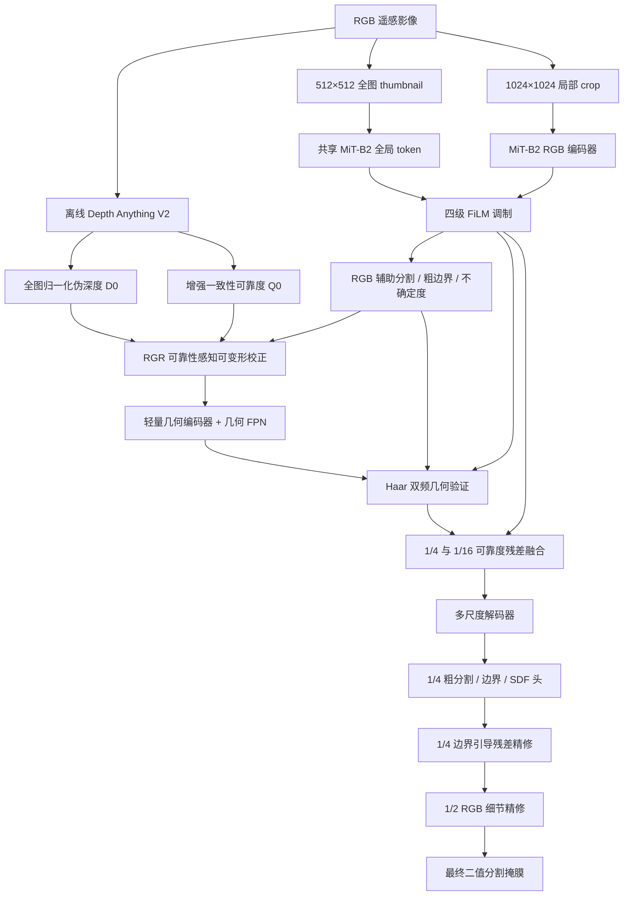

# RPGV-Net 完整实现设计

本文档描述当前仓库中已实现的 RPGV-Net 网络、离线伪几何生成、三阶段训练和推理流程。代码实现是本文档的执行依据。

模型全称为 **RPGV-Net：Reliability-aware Pseudo-Geometry Rectification and Validation Network（可靠性感知伪几何校正与验证网络）**。

核心问题是：

> 在没有真实 DSM/DEM 的条件下，如何校正单目模型产生的不可靠伪几何，并且仅在其确实有助于分割时，用它补全污水处理厂范围和精修边界。

模型遵循“可靠 RGB 主路径 + 受约束几何残差”的原则。伪深度不会与 RGB 对称融合，也不能无约束地演化成另一张分割掩膜；几何残差按可靠度连续缩放，可靠度为零时退回 RGB 路径。

主要实现文件：

- 模型编排：[wwtpseg/models/segmentors/rpgv_net.py](../wwtpseg/models/segmentors/rpgv_net.py)
- 网络模块：[wwtpseg/models/utils/rpgv_modules.py](../wwtpseg/models/utils/rpgv_modules.py)
- RPGV 数据变换：[wwtpseg/datasets/transforms/rpgv_transforms.py](../wwtpseg/datasets/transforms/rpgv_transforms.py)
- 伪几何加载：[wwtpseg/datasets/transforms/load_pseudo_geometry.py](../wwtpseg/datasets/transforms/load_pseudo_geometry.py)
- 离线生成工具：[tools/generate_pseudo_geometry.py](../tools/generate_pseudo_geometry.py)
- 三阶段训练脚本：[scripts/train_rpgv_stages.sh](../scripts/train_rpgv_stages.sh)

---

## 一、总体结构



Depth Anything 全程离线、冻结，不进入分割训练计算图。几何阶段和联合阶段的局部输入为：

$$
X=[B,G,R,D_0,Q_0].
$$

五个通道在数据管线中使用 $0\sim255$ 范围。模型内部将 BGR 转成 RGB 并做 ImageNet 归一化，深度和可靠度除以 255 恢复到 $[0,1]$。第一阶段是 RGB-only 预训练，只接收三通道 BGR，但仍使用完整场景 thumbnail。

---

## 二、离线伪深度和可靠度

### 1. 深度模型

默认使用 depth-anything/Depth-Anything-V2-Base-hf，由 transformers 4.44.2 加载：

```bash
python tools/generate_pseudo_geometry.py \
  wwtp_semantic_dataset \
  --device cuda
```

### 2. 高分辨率预测

对每张约 $2048\times2048$ 原图执行：

1. 将全图长边缩放到 518，预测全局深度 $D_g$；
2. 使用 $1024\times1024$ 局部块和 25% 重叠率预测 $D_k$；
3. 用稳健最小二乘对齐局部尺度和平移：

   $$
   D_k'=a_kD_k+b_k;
   $$

4. 用下限为 0.05 的 Hann 窗融合重叠块；
5. 在整张原图上进行百分位归一化：

   $$
   D_0=\operatorname{clip}
   \left(
   \frac{D-P_2(D)}
   {P_{98}(D)-P_2(D)+\epsilon},
   0,1
   \right).
   $$

归一化发生在裁剪训练块之前，训练 crop 不再独立归一化。

### 3. 初始可靠度

生成工具默认预测恒等、水平翻转、垂直翻转和 0.75 倍尺度四组深度。恢复坐标并对齐后计算：

$$
U_d(x)=\operatorname{Var}
\left\{
T_k^{-1}[\operatorname{Align}(D(T_k(I)))]
\right\},
$$

$$
Q_0(x)=\exp[-U_d(x)/\tau],\qquad \tau=0.01.
$$

### 4. 存储

```text
wwtp_semantic_dataset/
└── pseudo_geometry/
    ├── train/<image_stem>.npz
    ├── val/<image_stem>.npz
    └── test/<image_stem>.npz
```

每个 NPZ 包含 uint16 的 depth 和 uint8 的 reliability。加载器将它们映射回 $[0,1]$，也兼容旧的浮点归档。可用环境变量 WWTP_PSEUDO_ROOT 指定其他目录。

正式配置要求每张图都有伪几何；缺失时直接报错，不会静默使用灰度图或常量深度。

---

## 三、输入尺度和数据增强

### 1. 局部块与全图上下文

训练样本同时包含：

- $1024\times1024$ 局部输入；
- $512\times512$ 全图 thumbnail；
- 与局部输入同步的分割标签。

thumbnail 在局部随机缩放、旋转和裁剪之前保存，因此始终表示完整场景，并与局部图像共享 MiT-B2。

### 2. 管线顺序

RGB 第一阶段：

1. 读取 RGB 和标签；
2. RGB 颜色增强；
3. 生成 512 thumbnail；
4. 随机缩放、旋转、前景感知裁剪和翻转；
5. 同时打包局部图、标签和 thumbnail。

几何和联合阶段：

1. 读取 RGB 和标签；
2. 仅对 RGB 做颜色增强；
3. 生成 512 thumbnail；
4. 加载 $D_0,Q_0$，拼成五通道；
5. 对五通道和标签同步做空间增强；
6. 以 30% 概率破坏伪深度；
7. 打包局部输入、标签和 thumbnail。

空间增强参数：

- 随机缩放 0.5–1.5；
- 50% 概率执行 $\pm180^\circ$ 随机旋转；
- 正样本 80% 概率使用前景感知 crop；
- 75% 概率选择水平、垂直或对角翻转。

### 3. 深度破坏增强

RandomPseudoGeometryCorruption 以 30% 概率随机选择：

- 高斯噪声；
- 3/5/7 核高斯模糊；
- 10%–30% 局部块置零；
- 0.7–1.3 scale 和 ±0.15 shift；
- 整幅深度置零。

破坏时不修改输入中的 $Q_0$，但数据管线会生成仅用于损失监督的软有效度图：未破坏区域为 1，整幅置零区域为 0，噪声、模糊和尺度偏移按破坏强度给出软目标。该图不会拼入模型输入，任务可靠度仍必须根据 RGB/几何不一致性识别错误深度。

---

## 四、RGB 主分支和全图 FiLM

### 1. MiT-B2 特征

对于 $1024\times1024$ 局部输入：

| 特征 | 分辨率 | 通道数 |
| --- | ---: | ---: |
| $R_1$ | $256\times256$ | 64 |
| $R_2$ | $128\times128$ | 128 |
| $R_3$ | $64\times64$ | 320 |
| $R_4$ | $32\times32$ | 512 |

MiT-B2 加载 ImageNet 预训练权重。

### 2. 全图 token

thumbnail 经过共享 MiT-B2，最深层全局平均池化：

$$
t_g=\operatorname{GAP}(R_4^{global}).
$$

四级局部特征分别执行：

$$
\widetilde R_i=
(1+\gamma_i(t_g))\odot R_i+\beta_i(t_g).
$$

FiLM 线性层零初始化，初始时 $\widetilde R_i=R_i$。滑窗推理只计算一次全图 token，并在所有局部窗口间复用。

### 3. RGB 辅助输出

在 $\widetilde R_1$ 上产生 RGB 辅助分割 $Z_r$、粗边界 $Z_{br}$ 和归一化二元熵：

$$
B_r=\sigma(Z_{br}),
$$

$$
U_r=
-\frac{P_r\log P_r+(1-P_r)\log(1-P_r)}
{\log2},
\qquad P_r=\sigma(Z_r).
$$

RGB 是基础路径，几何只在两个尺度做残差修改。

---

## 五、RGR 可靠性感知几何校正

$D_0,Q_0$ 插值到 $\widetilde R_1$ 的 $1/4$ 尺度：

$$
F_d=f_d[
D_0,\partial_xD_0,\partial_yD_0,|\nabla D_0|
]\in\mathbb R^{32\times H/4\times W/4},
$$

$$
F_r=\operatorname{Proj}(\widetilde R_1).
$$

联合特征预测 3×3 调制可变形卷积的 18 个偏移和 9 个调制通道：

$$
[\Delta p,M]=f_{om}[F_d,F_r,B_r],
$$

$$
\Delta p=2\tanh(\Delta p),\qquad M=\sigma(M).
$$

偏移限制在特征空间的 $\pm2$ 像素。实现使用 grid_sample 完成可移植的调制可变形采样：

$$
F_d'=\operatorname{DeformConv}(F_d,\Delta p,M).
$$

任务可靠度：

$$
Q_{learn}=\sigma(f_q[F_d',F_r,Q_0]),
$$

$$
Q_d=Q_0\odot Q_{learn}.
$$

$Q_{learn}$ 被定义为对离线先验的衰减因子，输出层零权重并以 0.95 初始化，因此训练开始时 $Q_d\approx0.95Q_0$，而不是意外退化为 $Q_0^2$。可靠度只由干净/破坏有效度目标训练；下游分割梯度在可靠度处停止，防止其演化成语义掩膜。

有界残差校正：

$$
\widehat D=
\operatorname{clip}
\left[
D_0+\alpha Q_d\odot\tanh(f_{res}[F_d',B_r]),
0,1
\right].
$$

其中 $\alpha=0.25\sigma(\theta)$，初始值 0.1、最大值 0.25。偏移输出层和深度残差层零初始化，因此 RGR 初始接近恒等映射。

---

## 六、轻量几何编码器

几何描述符：

$$
G_0=[
\widehat D,
\partial_x\widehat D,
\partial_y\widehat D,
|\nabla\widehat D|,
\nabla^2\widehat D,
R_3(\widehat D),
R_7(\widehat D),
Q_d
],
$$

$$
R_k(\widehat D)=
\widehat D-\operatorname{AvgPool}_k(\widehat D).
$$

编码器使用 GroupNorm、GELU 和深度可分离卷积：

| 特征 | 分辨率 | 通道数 |
| --- | ---: | ---: |
| $G_1$ | $256\times256$ | 32 |
| $G_2$ | $128\times128$ | 64 |
| $G_3$ | $64\times64$ | 128 |
| $G_4$ | $32\times32$ | 256 |

四级输出随后进入轻量自顶向下几何 FPN。$G_4$ 的语义上下文逐级传到
$G_3,G_2,G_1$，各级保持原通道数。融合后的 $G_1$ 产生几何辅助 logit
$Z_g$，因此第二阶段的几何分割损失可以训练全部四级几何编码器，而不再只
训练最浅层。第二阶段验证直接评估 $Z_g$，最终推理不把它作为结果。

---

## 七、DFGV 双频几何验证

$\widetilde R_1$ 和 $G_1$ 投影到 32 通道后执行一级正交 Haar DWT：

$$
(L_r,H_r)=\operatorname{DWT}(\widetilde R_1),
\qquad
(L_g,H_g)=\operatorname{DWT}(G_1).
$$

$L$ 是 LL 低频，$H$ 是拼接的 LH、HL、HH 高频。实现支持奇数尺寸的复制填充和恢复裁剪。

高频验证：

$$
W_h=\sigma
\left(
f_h[H_r,H_g,|H_r-H_g|,Q_d,B_r]
\right),
$$

$$
\Delta H=
W_h\odot\operatorname{Proj}(H_g).
$$

零低频与 $\Delta H$ 经过逆 DWT 得到 $1/4$ 边界修正 $\Delta F_h$。

区域验证直接使用融合后的 $1/16$ 深层特征：

$$
W_l=\sigma
\left(
f_l[R_3,G_3,|R_3-G_3|,Q_d,U_r]
\right),
$$

$$
\Delta F_l=
W_l\odot\operatorname{Proj}(G_3).
$$

$\Delta F_l$ 直接产生于 $1/16$，使深层几何语义成为区域补全内容，而不是
只参与融合权重。Haar 高频路径仍负责 $1/4$ 边界修正。

---

## 八、可靠度加权残差融合

DFGV 已分别验证高频边界候选和深层区域候选，融合层不再学习第二套专家选择
门控。残差只经过通道投影，并按任务可靠度连续加权：

$$
X_i=R_i+Q_d\odot\tanh(\operatorname{Proj}(\Delta F_i)).
$$

只在两个位置融合：

- $1/4$：高频边界修正；
- $1/16$：低频区域补全。

$R_2,R_4$ 保持纯 RGB。可靠度只在这里乘入一次，`tanh` 将每通道残差限制在
$[-1,1]$。残差投影零初始化，使联合训练第一步严格等价于 RGB 路径；随后
由最终分割损失直接学习残差内容。

---

## 九、解码和边界残差精修

四级特征各投影到 128 通道并上采样到 $1/4$，拼接后得到 $F_{dec}$。内部头包括：

1. 粗分割 $Z_c$；
2. 边界 $\widehat B$；
3. SDF $\widehat S$。

精修门控：

$$
G_b=
\sigma
\left(
f_b[
\sigma(\widehat B),
1-|\tanh(\widehat S)|,
U_c,Q_d
]
\right).
$$

第一步精修 logit：

$$
\Delta Z=
f_{refine}[F_{dec},Z_c,\widehat B,\widehat S],
$$

$$
Z_{1/4}=Z_c+G_b\odot\Delta Z.
$$

随后从归一化 RGB 提取 $1/2$ 分辨率细节特征，与上采样后的解码特征和
$Z_{1/4}$ 融合，预测第二级边界与有界位置门控：

$$
Z_{final}=\operatorname{Up}(Z_{1/4})+G_{detail}\odot\Delta Z_{detail}.
$$

两级精修输出层均零初始化。细节分支只增加 32 个通道，主要恢复在 $1/4$
监督和上采样中容易损失的窄结构及边缘。

为兼容 MMSeg 二分类接口，模型返回：

$$
Z_{mmseg}=[0,Z_{final}].
$$

前景 softmax 等价于 $\sigma(Z_{final})$，最终输出仍是一张类别 1 的二值掩膜。

---

## 十、损失函数

最终、RGB、几何和边界预测使用带 ignore mask 的：

$$
L_{seg}=0.5L_{BCE}+0.5L_{Dice}.
$$

标签 255 不参与损失。

AMP 下 BCE、Dice、SDF、可靠度和保持损失的概率计算及空间归约显式使用
FP32。可靠度头同时输出 logit 与 sigmoid 概率，监督使用
`binary_cross_entropy_with_logits`，避免 CUDA autocast 不允许普通概率 BCE
的问题；概率仍用于几何可靠度加权，不改变监督目标。

RGB 不确定性与两级精修统一使用稳定的二元熵公式（FP32）：

$$
H(z)=\frac{\operatorname{softplus}(-|z|)+|z|\sigma(-|z|)}{\ln 2}.
$$

旧公式在 FP16 下把 $1-10^{-6}$ 舍入为 1，饱和正 logit 导致 $0\log0$；
即使精修残差初始化为零，`NaN * 0` 也会污染预测。旧 Dice 路径因乘以
FP32 valid mask 已发生类型提升，不能仅凭输入尺寸就断言其是本次 NaN 根因。
`parse_losses` 在发现非有限前向损失时，报告阶段与损失名称并在反向传播前
停止；GradScaler 仍正常处理偶发的梯度溢出，不用置零损失掩盖错误。

最终 logit 上采样到输入尺度后计算主分割损失。边界标签分别在对应尺度由
3×3 形态学梯度产生，同时监督 $1/2$ 细节边界、$1/4$ 解码边界和 RGB 粗
边界，三者取平均。

SDF 使用精确欧氏距离变换：

$$
S^*=
\operatorname{clip}
\left(
\frac{d_{fg}-d_{bg}}{5},
-1,1
\right),
$$

距离在 $1/4$ 特征尺度计算，截断 5 个特征像素等价于输入尺度约 20 像素，并用 Smooth L1 监督 $\tanh(\widehat S)$。

可靠度与保持损失：

$$
L_{reliability}=
\operatorname{BCE}(Q_{learn},Q_{valid}),
$$

$$
L_{preserve}=
\|\widehat D-D_0\|_1.
$$

等变损失在第二、三阶段随机采用水平或垂直翻转：

$$
L_{equivariance}=
\operatorname{SmoothL1}
\left(
T^{-1}[\widehat D(T(X))],
\operatorname{stopgrad}(\widehat D(X))
\right).
$$

两分支共享同一个全图 token。

联合阶段总损失：

$$
\begin{aligned}
L={}&L_{final}
+0.3L_{rgb}
+0.2L_{geo}
+0.2L_{boundary}\\
&+0.1L_{SDF}
+0.05L_{reliability}
+0.05L_{preserve}\\
&+0.05L_{equivariance}.
\end{aligned}
$$

| 损失 | 实现 | 作用 |
| --- | --- | --- |
| $L_{final}$ | BCE + Dice | 最终分割 |
| $L_{rgb}$ | BCE + Dice | RGB 退化路径 |
| $L_{geo}$ | BCE + Dice | 几何判别能力 |
| $L_{boundary}$ | BCE + Dice | RGB 和最终边界 |
| $L_{SDF}$ | Smooth L1 | 连续轮廓距离 |
| $L_{reliability}$ | BCE | 拟合训练期软几何有效度 |
| $L_{preserve}$ | L1 | 限制深度校正 |
| $L_{equivariance}$ | Smooth L1 | 翻转一致性 |

---

## 十一、三阶段训练

三个阶段使用相同参数结构，checkpoint 可以严格加载。training_stage 只控制输入、前向出口、损失和 requires_grad。

### 阶段一：RGB 预训练

配置：configs/experiments/rpgv_stage1_rgb.py

- 输入三通道 RGB 和 512 thumbnail；
- 训练 MiT-B2、FiLM、RGB 辅助头、解码器及两级精修头；
- 冻结且不执行几何相关模块；
- 损失为 $L_{final}+0.3L_{rgb}+0.2L_{boundary}+0.1L_{SDF}$；
- 验证输出为 RGB 解码后的最终分割；
- 训练 40k iterations。

### 阶段二：几何预训练

配置：configs/experiments/rpgv_stage2_geometry.py

- 从阶段一 checkpoint 初始化；
- 输入五通道局部块和 512 thumbnail；
- RGB 编码器、FiLM、RGB 辅助头、解码器、DFGV 和残差融合层冻结；
- 冻结 RGB 教师保持 eval，关闭 DropPath 随机性；
- 只训练 RGR、几何编码器、几何 FPN 和几何辅助头；
- 损失为 $0.2L_{geo}+0.05L_{reliability}+0.05L_{preserve}+0.05L_{equivariance}$；
- 验证输出为 $Z_g$；
- 训练 20k iterations。

原草案只要求冻结 RGB 前两阶段。当前冻结完整 RGB 专家，是为了在没有最终融合监督时保护阶段一得到的 RGB 表征。

### 阶段三：联合微调

配置：configs/experiments/rpgv_stage3_joint.py

- 从阶段二 checkpoint 初始化；
- 全部模块解冻；
- MiT-B2 学习率为新模块的 0.1 倍；
- 已训练的 FiLM、RGB 辅助头、解码器和两级精修器学习率为新模块的 0.25 倍；
- 15% 概率令整幅有效可靠度为零，以持续监督 RGB-only 退化路径；
- 启用完整联合总损失，几何残差由最终分割目标端到端学习；
- 验证输出最终融合分割；
- 训练 40k iterations。

### 共同训练参数

| 项目 | 设置 |
| --- | --- |
| 局部 crop | $1024\times1024$ |
| thumbnail | $512\times512$ |
| 单卡 batch size | 1 |
| 梯度累积 | 8 |
| 有效 batch size | 8 |
| 优化器 | AdamW |
| 新模块学习率 | $6\times10^{-4}$ |
| MiT-B2 学习率 | $6\times10^{-5}$ |
| Weight decay | 0.01 |
| 梯度裁剪 | 最大范数 10 |
| 混合精度 | AMP |
| 阶段一/三 warm-up | 1500 iterations |
| 阶段二 warm-up | 1000 iterations |
| 学习率策略 | PolyLR，power=0.9 |
| 验证/checkpoint 间隔 | 2000 iterations |
| 最佳模型指标 | binary/Foreground_IoU |

### 自动串联

```bash
bash scripts/train_rpgv_stages.sh
```

默认目录：

```text
work_dirs/rpgv_staged/
├── stage1_rgb/
├── stage2_geometry/
└── stage3_joint/
```

脚本优先选择每阶段最佳 Foreground IoU checkpoint，并传给下一阶段。可用 RPGV_WORK_ROOT 修改根目录。阶段二和三缺少前一阶段 checkpoint 时，训练入口会直接报错。

configs/experiments/rpgv_net.py 保留为 3k iterations 的直接联合训练消融，不代表完整三阶段实验。

---

## 十二、推理

验证和测试保留原始约 $2048\times2048$ 分辨率：

- crop：$1024\times1024$；
- stride：$768\times768$；
- 重叠率：25%。

推理先从完整 RGB 生成 512 thumbnail，只计算一次全图 token；所有滑窗复用该 token。重叠区域使用下限为 0.05 的二维 Hann 窗对 logits 加权平均，以降低窗口边缘拼接缝。

```bash
python tools/test.py \
  configs/experiments/rpgv_stage3_joint.py \
  work_dirs/rpgv_staged/stage3_joint/best_binary_Foreground_IoU_iter_*.pth
```

tools/test.py 直接加载命令行 checkpoint，不要求设置阶段二环境变量。

---

## 十三、评价指标

MMSeg IoUMetric 输出 aAcc、mIoU、mAcc、mDice 和 mFscore。

BinaryBoundaryMetric 输出：

| 指标 | 含义 |
| --- | --- |
| Foreground_IoU | 类别 1 的全局 IoU |
| Dice / F1 | 前景 Dice/F1 |
| Precision / Recall | 前景查准率和查全率 |
| Boundary_F1 / BFScore | 3 px 容差内边界 F1 |
| Boundary_Precision/Recall | 边界精度和召回率 |
| Hausdorff_px/m | 对称 Hausdorff 均值 |
| HD95_px/m | 95% Hausdorff 均值 |

当前项目没有 Boundary IoU 或 ASSD，不应在默认结果中声明它们。

---

## 十四、工程调整

| 原始描述 | 当前实现 | 原因 |
| --- | --- | --- |
| MMCV DCNv2 | grid_sample 调制可变形卷积 | 支持 CPU 和不同后端 |
| 全分辨率校正 | $1/4$ 尺度校正 | 控制显存和计算量 |
| 阶段二冻结 RGB 前两层 | 冻结完整 RGB 专家 | 保护阶段一基线 |
| 浮点伪几何 | uint16 深度 + uint8 可靠度 | 降低存储 |
| 滑窗 Hann 融合 | 下限 0.05 的 Hann logits 加权 | 降低窗口边缘拼接缝 |
| 任意旋转等变双前向 | 水平/垂直翻转等变 | 避免再次插值深度 |

这些调整不改变核心假设：先校正几何，再验证频率一致性，最后以可靠度约束的非对称残差形式注入 RGB。

---

## 十五、验证

```bash
python tools/smoke_test.py \
  --models rpgv_stage1_rgb \
  --input-size 64 --backward

python tools/smoke_test.py \
  --models rpgv_stage2_geometry \
  --input-size 64 --backward

python tools/smoke_test.py \
  --models rpgv_stage3_joint \
  --input-size 64 --backward
```

测试覆盖：

- 三阶段配置注册；
- 阶段专属参数冻结；
- RGB-only 和五通道输入；
- thumbnail 打包与 FiLM；
- 伪几何读取和破坏增强；
- 五通道空间增强同步；
- Haar DWT 正逆变换；
- 阶段专属损失；
- 等变分支；
- 反向传播；
- 全分辨率 FP16 输入下的 FP32 Dice/熵数值稳定性；
- 无融合门控时的有界几何残差；
- 四级几何编码器和最深层 FPN 的梯度连通性；
- $1/2$ 高分辨率细节精修；
- 阶段对应的验证输出；
- 滑窗推理和输出尺寸。

真实 CUDA AMP 数值回归：

```bash
python tools/test_rpgv_numerics.py -v
```

覆盖三阶段原有 AdamW/动态 GradScaler 配置与 8 步梯度累积，每阶段要求
至少两次真正的参数更新，并检查梯度、参数和优化器状态有限；模型输入缩为
64，另行检查 $1024\times1024$ 损失的前向与反向。还覆盖饱和 logits 的两级
精修、全忽略标签、可靠度正负监督和 RGB 到联合训练的细节分支初始化一致性。
无 CUDA 时明确跳过 GPU 用例，不把 CPU 半精度输入测试等同于 AMP 训练测试。

默认完整模型约 27.14M 参数。

---

## 十六、消融实验

### 1. 实现原则

消融实验不复制 RPGV-Net 类。`component_cfg` 只改变前向路径，所有变体仍实例化
相同模块并保留相同 `state_dict` 键，因此可以严格复用阶段 checkpoint。被旁路的
参数会同步冻结，避免 DDP 未使用参数问题，也使可训练参数量能够反映真实实验。

下表是可用的消融开关全集；实际执行子集见下一节。开关的默认值均为 `True`：

| 开关 | 关闭后的行为 | 对应配置 |
| --- | --- | --- |
| `global_context` | 不计算全图 token，不执行 FiLM | `rpgv_no_global_context.py` |
| RGR 整体 | 同时关闭深度校正与学习可靠度，直接使用 $D_0,Q_0$ | `rpgv_no_rgr.py` |
| `depth_rectification` | 使用原始 $D_0$，跳过有界深度残差；保持与等变损失同步关闭 | `rpgv_no_depth_rectification.py` |
| `learned_reliability` | 直接使用离线 $Q_0$；可靠度监督同步关闭 | `rpgv_offline_reliability_only.py` |
| `frequency_validation` | 以同尺度几何投影替代 Haar/跨模态验证，仍保留两处残差注入 | `rpgv_no_frequency_validation.py` |
| `boundary_fusion` | 移除 $1/4$ 边界残差 | `rpgv_no_boundary_fusion.py` |
| `region_fusion` | 移除 $1/16$ 区域残差 | `rpgv_no_region_fusion.py` |
| 两尺度融合整体 | 同时移除 $1/4$ 与 $1/16$ 几何残差 | `rpgv_no_geometry_fusion.py` |
| `reliability_weighting` | 注入有界残差时不再乘 $Q_d$ | `rpgv_unweighted_fusion.py` |
| `boundary_refinement` | 直接使用 $1/4$ 粗 logit，仍保留形状辅助监督 | `rpgv_no_boundary_refinement.py` |
| `detail_refinement` | 不执行 $1/2$ RGB 细节精修 | `rpgv_no_detail_refinement.py` |

另有两个训练机制消融：`rpgv_no_geometry_dropout.py` 将几何 dropout 概率设为
0；`rpgv_no_shape_auxiliary.py` 将边界与 SDF 损失权重设为 0。RGB-only 对照直接
使用阶段一最佳 checkpoint，避免把“无几何”与一条仍接收可靠度的联合路径混淆。

`frequency_validation=False` 不是把几何残差置零，而是使用 $G_1/G_3$ 的直接
通道投影。这样它只检验 DFGV 的频率分解与跨模态验证是否有效，不会同时删除
几何信息，符合单因素消融原则。类似地，关闭边界精修时仍保留边界/SDF 辅助
任务；显式形状监督由独立配置检验。

### 2. 精简执行计划（2026-09-21）

原计划的 12 项消融缩减为 **7 项**：保留已完成的 4 项和正在运行的 1 项，
后续只增加 `no_depth_rectification` 与 `no_geometry_fusion`。后者同时关闭
`boundary_fusion` 和 `region_fusion`，只检验两处几何残差注入的**整体贡献**，
不能据此分别归因于 $1/4$ 边界融合或 $1/16$ 区域融合。

| 状态 | 消融任务 | 决策依据 |
| --- | --- | --- |
| 已完成 | `no_rgr`、`no_frequency_validation`、`no_global_context`、`unweighted_fusion` | 已覆盖 RGR 整体、双频验证、全局上下文和可靠度加权四个主要假设 |
| 进行中 | `no_detail_refinement` | 检验 $1/2$ RGB 细节精修；未得到验证和测试结果前不算完成 |
| 待做 | `no_depth_rectification` | 与 `no_rgr` 配合，进一步检验深度校正的作用 |
| 待做（合并） | `no_geometry_fusion`：`boundary_fusion=False` 且 `region_fusion=False` | 替代分别运行 `no_boundary_fusion` 和 `no_region_fusion`，检验几何注入整体作用 |
| 暂跳过 | `offline_reliability_only` | 已有 RGR 整体实验；如需单独证明学习可靠度的贡献，再补做 |
| 暂跳过 | `no_boundary_refinement`、`no_shape_auxiliary` | 与细节精修分别检验不同因素；跳过后不得声称已单独验证这两项的贡献 |
| 暂跳过 | `no_geometry_dropout` | 常规干净测试集不能直接检验几何失效时的 RGB 回退能力；如需主张鲁棒性，应配合缺失或破坏几何的测试补做 |

`no_geometry_fusion` 的联合配置在同一次训练中将两个开关同时设为 `False`；
不能把两项单独消融的结果相加或当作联合结果。两个消融脚本的默认列表只包含
上述 7 项；自动运行器默认仅执行两个待做项，`--ablation all` 才选择 7 项。
跳过的单项配置仍可显式选择。上述 7 项是不同模型
变体的数量，不包含完整模型和 RGB-only 对照。
暂跳过仅代表当前研究范围的取舍，不代表这些模块已被证明无效。

现有结果属于从同一阶段二 checkpoint 出发的阶段三快速诊断。
截至本次调整，四项已完成消融的测试 Foreground IoU 分别为：
`no_rgr` 73.63%、`no_frequency_validation` 70.73%、
`no_global_context` 71.83%、`unweighted_fusion` 70.67%；
完整模型为 77.17%。但完整模型训练了 40k 步，已完成消融因提前停止实际仅
训练了 4k–8k 步，其中 `no_rgr` 的梯度累积为 4，其余为 8。
因此这些分数只用于确定后续优先级，不能直接解释为模块的精确性能增益。

当前先沿用已有消融的阶段三快速诊断配置，完成两个待做变体；自动运行器默认
只执行它们，不会重复运行已完成实验或触碰正在运行的 `no_detail_refinement`：

```bash
python3 scripts/run_ablation_suite.py --ablation pending
```

运行器沿用同一阶段二 checkpoint、16k 步上限、每 1k 步验证、梯度累积 8 和
现有提前停止规则，训练结束后用最佳验证 checkpoint 测试，结果仍写入
`work_dirs/rpgv_ablations/`。如任务工作目录已有未完成训练，运行器会停止，
避免把训练途中的最佳 checkpoint 误当作最终结果。单项入口
`scripts/run_single_ablation.sh` 也调用同一运行器。

后续若要进行正式性能归因，需补充同协议的 `full` 对照，并统一训练步数、
学习率计划、验证间隔、梯度累积和停止规则；`no_rgr` 至少需按统一梯度累积
重跑。完整模型的验证曲线在早期回落后仍再次提高，因此当前提前停止结果只
适合快速诊断。正式论文结论应使用下节的完整三阶段训练协议。

### 3. 公平训练协议

正式消融应从阶段一开始完整重训，而不是只在阶段三临时关闭模块：

```bash
bash scripts/train_rpgv_ablations.sh
```

脚本对每个变体复用与完整模型相同的数据、40k/20k/40k 三阶段 schedule、优化器
和评价指标，只通过 `--cfg-options` 改一个因素。默认输出到：

```text
work_dirs/rpgv_ablations/<ablation>/
├── stage1_rgb/
├── stage2_geometry/
└── stage3_joint/
```

可通过空格分隔的 `RPGV_ABLATIONS` 选择子集；`full` 可用于在同一目录结构下
重跑完整对照。脚本默认列表为精简后的 7 项；例如只选择完整对照和两个待做
变体：

```bash
RPGV_ABLATIONS="full no_depth_rectification no_geometry_fusion" \
  bash scripts/train_rpgv_ablations.sh
```

上述完整三阶段入口与本次继续执行的阶段三快速诊断入口不同；本次先使用前节
的 `run_ablation_suite.py --ablation pending`。

`configs/ablations/` 下的独立配置继承阶段三配置，适合已有统一阶段二 checkpoint
时做快速诊断；它们不替代正式的全流程重训。快速运行示例：

```bash
bash scripts/train_rpgv_ablations_from_stage2.sh
```

该脚本默认从 7 项计划中选择变体，并自动选择
`work_dirs/rpgv_staged/stage2_geometry/` 中最新的最佳
checkpoint，并把变体写入 `work_dirs/rpgv_ablations_stage3/`。也可通过
`RPGV_STAGE2_CHECKPOINT` 指定 checkpoint，通过 `RPGV_ABLATIONS` 选择子集；
选择规则与完整重训脚本相同。

### 4. 汇总与验证

汇总工具会在每个变体的 `stage3_joint` 日志中按 Foreground IoU 选择最佳验证
记录，并同时报告 Dice、Boundary F1 和 HD95：

```bash
python tools/summarize_rpgv_ablations.py \
  work_dirs/rpgv_ablations \
  --format markdown \
  --output work_dirs/rpgv_ablations/summary.md
```

所有独立消融配置已纳入 smoke test 的配置发现范围：

```bash
python tools/smoke_test.py \
  --models rpgv_no_frequency_validation rpgv_no_detail_refinement \
  --input-size 64 --backward
```
