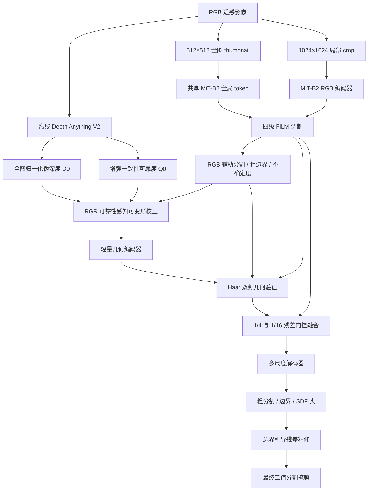

# RPGV-Net 完整实现设计

本文档描述当前仓库中已实现的 RPGV-Net 网络、离线伪几何生成、三阶段训练和推理流程。代码实现是本文档的执行依据。

模型全称为 **RPGV-Net：Reliability-aware Pseudo-Geometry Rectification and Validation Network（可靠性感知伪几何校正与验证网络）**。

核心问题是：

> 在没有真实 DSM/DEM 的条件下，如何校正单目模型产生的不可靠伪几何，并且仅在其确实有助于分割时，用它补全污水处理厂范围和精修边界。

模型遵循“可靠 RGB 主路径 + 受约束几何残差”的原则。伪深度不会与 RGB 对称融合，也不能无约束地演化成另一张分割掩膜；当几何不可靠时，门控可以关闭残差并退回 RGB 路径。

主要实现文件：

- 模型编排：[wwtpseg/models/segmentors/rpgv_net.py](../wwtpseg/models/segmentors/rpgv_net.py)
- 网络模块：[wwtpseg/models/utils/rpgv_modules.py](../wwtpseg/models/utils/rpgv_modules.py)
- RPGV 数据变换：[wwtpseg/datasets/transforms/rpgv_transforms.py](../wwtpseg/datasets/transforms/rpgv_transforms.py)
- 伪几何加载：[wwtpseg/datasets/transforms/load_pseudo_geometry.py](../wwtpseg/datasets/transforms/load_pseudo_geometry.py)
- 离线生成工具：[tools/generate_pseudo_geometry.py](../tools/generate_pseudo_geometry.py)
- 三阶段训练脚本：[scripts/train_rpgv_stages.sh](../scripts/train_rpgv_stages.sh)

---

## 一、总体结构



Depth Anything 全程离线、冻结，不进入分割训练计算图。几何阶段和联合阶段的局部输入为：

$$
X=[B,G,R,D_0,Q_0].
$$

五个通道在数据管线中使用 $0\sim255$ 范围。模型内部将 BGR 转成 RGB 并做 ImageNet 归一化，深度和可靠度除以 255 恢复到 $[0,1]$。第一阶段是 RGB-only 预训练，只接收三通道 BGR，但仍使用完整场景 thumbnail。

---

## 二、离线伪深度和可靠度

### 1. 深度模型

默认使用 depth-anything/Depth-Anything-V2-Base-hf，由 transformers 4.44.2 加载：

```bash
python tools/generate_pseudo_geometry.py \
  wwtp_semantic_dataset \
  --device cuda
```

### 2. 高分辨率预测

对每张约 $2048\times2048$ 原图执行：

1. 将全图长边缩放到 518，预测全局深度 $D_g$；
2. 使用 $1024\times1024$ 局部块和 25% 重叠率预测 $D_k$；
3. 用稳健最小二乘对齐局部尺度和平移：

   $$
   D_k'=a_kD_k+b_k;
   $$

4. 用下限为 0.05 的 Hann 窗融合重叠块；
5. 在整张原图上进行百分位归一化：

   $$
   D_0=\operatorname{clip}
   \left(
   \frac{D-P_2(D)}
   {P_{98}(D)-P_2(D)+\epsilon},
   0,1
   \right).
   $$

归一化发生在裁剪训练块之前，训练 crop 不再独立归一化。

### 3. 初始可靠度

生成工具默认预测恒等、水平翻转、垂直翻转和 0.75 倍尺度四组深度。恢复坐标并对齐后计算：

$$
U_d(x)=\operatorname{Var}
\left\{
T_k^{-1}[\operatorname{Align}(D(T_k(I)))]
\right\},
$$

$$
Q_0(x)=\exp[-U_d(x)/\tau],\qquad \tau=0.01.
$$

### 4. 存储

```text
wwtp_semantic_dataset/
└── pseudo_geometry/
    ├── train/<image_stem>.npz
    ├── val/<image_stem>.npz
    └── test/<image_stem>.npz
```

每个 NPZ 包含 uint16 的 depth 和 uint8 的 reliability。加载器将它们映射回 $[0,1]$，也兼容旧的浮点归档。可用环境变量 WWTP_PSEUDO_ROOT 指定其他目录。

正式配置要求每张图都有伪几何；缺失时直接报错，不会静默使用灰度图或常量深度。

---

## 三、输入尺度和数据增强

### 1. 局部块与全图上下文

训练样本同时包含：

- $1024\times1024$ 局部输入；
- $512\times512$ 全图 thumbnail；
- 与局部输入同步的分割标签。

thumbnail 在局部随机缩放、旋转和裁剪之前保存，因此始终表示完整场景，并与局部图像共享 MiT-B2。

### 2. 管线顺序

RGB 第一阶段：

1. 读取 RGB 和标签；
2. RGB 颜色增强；
3. 生成 512 thumbnail；
4. 随机缩放、旋转、前景感知裁剪和翻转；
5. 同时打包局部图、标签和 thumbnail。

几何和联合阶段：

1. 读取 RGB 和标签；
2. 仅对 RGB 做颜色增强；
3. 生成 512 thumbnail；
4. 加载 $D_0,Q_0$，拼成五通道；
5. 对五通道和标签同步做空间增强；
6. 以 30% 概率破坏伪深度；
7. 打包局部输入、标签和 thumbnail。

空间增强参数：

- 随机缩放 0.5–1.5；
- 50% 概率执行 $\pm180^\circ$ 随机旋转；
- 正样本 80% 概率使用前景感知 crop；
- 75% 概率选择水平、垂直或对角翻转。

### 3. 深度破坏增强

RandomPseudoGeometryCorruption 以 30% 概率随机选择：

- 高斯噪声；
- 3/5/7 核高斯模糊；
- 10%–30% 局部块置零；
- 0.7–1.3 scale 和 ±0.15 shift；
- 整幅深度置零。

破坏时不修改输入中的 $Q_0$，但数据管线会生成仅用于损失监督的软有效度图：未破坏区域为 1，整幅置零区域为 0，噪声、模糊和尺度偏移按破坏强度给出软目标。该图不会拼入模型输入，任务可靠度仍必须根据 RGB/几何不一致性识别错误深度。

---

## 四、RGB 主分支和全图 FiLM

### 1. MiT-B2 特征

对于 $1024\times1024$ 局部输入：

| 特征 | 分辨率 | 通道数 |
| --- | ---: | ---: |
| $R_1$ | $256\times256$ | 64 |
| $R_2$ | $128\times128$ | 128 |
| $R_3$ | $64\times64$ | 320 |
| $R_4$ | $32\times32$ | 512 |

MiT-B2 加载 ImageNet 预训练权重。

### 2. 全图 token

thumbnail 经过共享 MiT-B2，最深层全局平均池化：

$$
t_g=\operatorname{GAP}(R_4^{global}).
$$

四级局部特征分别执行：

$$
\widetilde R_i=
(1+\gamma_i(t_g))\odot R_i+\beta_i(t_g).
$$

FiLM 线性层零初始化，初始时 $\widetilde R_i=R_i$。滑窗推理只计算一次全图 token，并在所有局部窗口间复用。

### 3. RGB 辅助输出

在 $\widetilde R_1$ 上产生 RGB 辅助分割 $Z_r$、粗边界 $Z_{br}$ 和归一化二元熵：

$$
B_r=\sigma(Z_{br}),
$$

$$
U_r=
-\frac{P_r\log P_r+(1-P_r)\log(1-P_r)}
{\log2},
\qquad P_r=\sigma(Z_r).
$$

RGB 是基础路径，几何只在两个尺度做残差修改。

---

## 五、RGR 可靠性感知几何校正

$D_0,Q_0$ 插值到 $\widetilde R_1$ 的 $1/4$ 尺度：

$$
F_d=f_d[
D_0,\partial_xD_0,\partial_yD_0,|\nabla D_0|
]\in\mathbb R^{32\times H/4\times W/4},
$$

$$
F_r=\operatorname{Proj}(\widetilde R_1).
$$

联合特征预测 3×3 调制可变形卷积的 18 个偏移和 9 个调制通道：

$$
[\Delta p,M]=f_{om}[F_d,F_r,B_r],
$$

$$
\Delta p=2\tanh(\Delta p),\qquad M=\sigma(M).
$$

偏移限制在特征空间的 $\pm2$ 像素。实现使用 grid_sample 完成可移植的调制可变形采样：

$$
F_d'=\operatorname{DeformConv}(F_d,\Delta p,M).
$$

任务可靠度：

$$
Q_{learn}=\sigma(f_q[F_d',F_r,Q_0]),
$$

$$
Q_d=Q_0\odot Q_{learn}.
$$

$Q_{learn}$ 被定义为对离线先验的衰减因子，输出层零权重并以 0.95 初始化，因此训练开始时 $Q_d\approx0.95Q_0$，而不是意外退化为 $Q_0^2$。可靠度只由干净/破坏有效度目标训练；下游分割梯度在可靠度处停止，防止其演化成语义掩膜。

有界残差校正：

$$
\widehat D=
\operatorname{clip}
\left[
D_0+\alpha Q_d\odot\tanh(f_{res}[F_d',B_r]),
0,1
\right].
$$

其中 $\alpha=0.25\sigma(\theta)$，初始值 0.1、最大值 0.25。偏移输出层和深度残差层零初始化，因此 RGR 初始接近恒等映射。

---

## 六、轻量几何编码器

几何描述符：

$$
G_0=[
\widehat D,
\partial_x\widehat D,
\partial_y\widehat D,
|\nabla\widehat D|,
\nabla^2\widehat D,
R_3(\widehat D),
R_7(\widehat D),
Q_d
],
$$

$$
R_k(\widehat D)=
\widehat D-\operatorname{AvgPool}_k(\widehat D).
$$

编码器使用 GroupNorm、GELU 和深度可分离卷积：

| 特征 | 分辨率 | 通道数 |
| --- | ---: | ---: |
| $G_1$ | $256\times256$ | 32 |
| $G_2$ | $128\times128$ | 64 |
| $G_3$ | $64\times64$ | 128 |
| $G_4$ | $32\times32$ | 256 |

$G_1$ 产生几何辅助 logit $Z_g$。第二阶段验证直接评估 $Z_g$，最终推理不把它作为结果。

---

## 七、DFGV 双频几何验证

$\widetilde R_1$ 和 $G_1$ 投影到 32 通道后执行一级正交 Haar DWT：

$$
(L_r,H_r)=\operatorname{DWT}(\widetilde R_1),
\qquad
(L_g,H_g)=\operatorname{DWT}(G_1).
$$

$L$ 是 LL 低频，$H$ 是拼接的 LH、HL、HH 高频。实现支持奇数尺寸的复制填充和恢复裁剪。

高频验证：

$$
W_h=\sigma
\left(
f_h[H_r,H_g,|H_r-H_g|,Q_d,B_r]
\right),
$$

$$
\Delta H=
W_h\odot\operatorname{Proj}(H_g).
$$

零低频与 $\Delta H$ 经过逆 DWT 得到 $1/4$ 边界修正 $\Delta F_h$。

低频验证：

$$
W_l=\sigma
\left(
f_l[L_r,L_g,|L_r-L_g|,Q_d,U_r]
\right),
$$

$$
\Delta F_l=
W_l\odot\operatorname{Proj}(L_g).
$$

$\Delta F_l$ 产生于 $1/8$，随后插值到 $1/16$ 参与区域补全。

---

## 八、UGRF 不确定性门控融合

门控输入：

$$
[
\operatorname{Proj}(R_i),
\operatorname{Proj}(G_i),
|\operatorname{Proj}(R_i)-\operatorname{Proj}(G_i)|,
Q_d,U_r,|P_r-P_g|
].
$$

内部门控和有效门控：

$$
\widetilde W_i=\sigma(f_i(\cdot)),
\qquad
W_i=Q_d\odot\widetilde W_i.
$$

融合：

$$
X_i=R_i+
W_i\odot\operatorname{Proj}(\Delta F_i).
$$

只在两个位置融合：

- $1/4$：高频边界修正；
- $1/16$：低频区域补全。

$R_2,R_4$ 保持纯 RGB。可靠度只在这里乘入一次。门控输出偏置初始化为 -2，残差投影零初始化，使联合训练第一步严格等价于 RGB 路径。

根据 RGB 和几何专家的逐像素 BCE 误差构造软目标：

$$
W^*=
1-\exp\left[
-\frac{\max(\ell_r-\ell_g-m,0)}{T}
\right],
\qquad T=0.5,\quad m=0.05.
$$

因此几何没有明确正收益时目标严格为零。停止 $W^*$ 的梯度后，高频门只在扩张后的边界带监督，低频门只在区域内部监督；损失作用于乘入可靠度后的有效门控。

---

## 九、解码和边界残差精修

四级特征各投影到 128 通道并上采样到 $1/4$，拼接后得到 $F_{dec}$。内部头包括：

1. 粗分割 $Z_c$；
2. 边界 $\widehat B$；
3. SDF $\widehat S$。

精修门控：

$$
G_b=
\sigma
\left(
f_b[
\sigma(\widehat B),
1-|\tanh(\widehat S)|,
U_c,Q_d
]
\right).
$$

最终 logit：

$$
\Delta Z=
f_{refine}[F_{dec},Z_c,\widehat B,\widehat S],
$$

$$
Z_{final}=Z_c+G_b\odot\Delta Z.
$$

精修输出层零初始化，初始时 $Z_{final}=Z_c$。

为兼容 MMSeg 二分类接口，模型返回：

$$
Z_{mmseg}=[0,Z_{final}].
$$

前景 softmax 等价于 $\sigma(Z_{final})$，最终输出仍是一张类别 1 的二值掩膜。

---

## 十、损失函数

最终、RGB、几何和边界预测使用带 ignore mask 的：

$$
L_{seg}=0.5L_{BCE}+0.5L_{Dice}.
$$

标签 255 不参与损失。

边界标签由 $1/4$ GT 的 3×3 形态学梯度产生。联合阶段同时监督 RGB 粗边界和最终边界，两者取平均。

SDF 使用精确欧氏距离变换：

$$
S^*=
\operatorname{clip}
\left(
\frac{d_{fg}-d_{bg}}{5},
-1,1
\right),
$$

距离在 $1/4$ 特征尺度计算，截断 5 个特征像素等价于输入尺度约 20 像素，并用 Smooth L1 监督 $\tanh(\widehat S)$。

可靠度与保持损失：

$$
L_{reliability}=
\operatorname{BCE}(Q_{learn},Q_{valid}),
$$

$$
L_{preserve}=
\|\widehat D-D_0\|_1.
$$

等变损失在第二、三阶段随机采用水平或垂直翻转：

$$
L_{equivariance}=
\operatorname{SmoothL1}
\left(
T^{-1}[\widehat D(T(X))],
\operatorname{stopgrad}(\widehat D(X))
\right).
$$

两分支共享同一个全图 token。

联合阶段总损失：

$$
\begin{aligned}
L={}&L_{final}
+0.3L_{rgb}
+0.2L_{geo}
+0.2L_{boundary}\\
&+0.1L_{SDF}
+0.05L_{reliability}
+0.05L_{preserve}\\
&+0.05L_{equivariance}
+0.1L_{gate}.
\end{aligned}
$$

| 损失 | 实现 | 作用 |
| --- | --- | --- |
| $L_{final}$ | BCE + Dice | 最终分割 |
| $L_{rgb}$ | BCE + Dice | RGB 退化路径 |
| $L_{geo}$ | BCE + Dice | 几何判别能力 |
| $L_{boundary}$ | BCE + Dice | RGB 和最终边界 |
| $L_{SDF}$ | Smooth L1 | 连续轮廓距离 |
| $L_{reliability}$ | BCE | 拟合训练期软几何有效度 |
| $L_{preserve}$ | L1 | 限制深度校正 |
| $L_{equivariance}$ | Smooth L1 | 翻转一致性 |
| $L_{gate}$ | BCE | 专家选择 |

---

## 十一、三阶段训练

三个阶段使用相同参数结构，checkpoint 可以严格加载。training_stage 只控制输入、前向出口、损失和 requires_grad。

### 阶段一：RGB 预训练

配置：configs/experiments/rpgv_stage1_rgb.py

- 输入三通道 RGB 和 512 thumbnail；
- 训练 MiT-B2、FiLM、RGB 辅助头、解码器和精修头；
- 冻结且不执行几何相关模块；
- 损失为 $L_{final}+0.3L_{rgb}+0.2L_{boundary}+0.1L_{SDF}$；
- 验证输出为 RGB 解码后的最终分割；
- 训练 40k iterations。

### 阶段二：几何预训练

配置：configs/experiments/rpgv_stage2_geometry.py

- 从阶段一 checkpoint 初始化；
- 输入五通道局部块和 512 thumbnail；
- RGB 编码器、FiLM、RGB 辅助头、解码器、DFGV 和 UGRF 冻结；
- 冻结 RGB 教师保持 eval，关闭 DropPath 随机性；
- 只训练 RGR、几何编码器和几何辅助头；
- 损失为 $0.2L_{geo}+0.05L_{reliability}+0.05L_{preserve}+0.05L_{equivariance}$；
- 验证输出为 $Z_g$；
- 训练 20k iterations。

原草案只要求冻结 RGB 前两阶段。当前冻结完整 RGB 专家，是为了在没有最终融合监督时保护阶段一得到的 RGB 表征。

### 阶段三：联合微调

配置：configs/experiments/rpgv_stage3_joint.py

- 从阶段二 checkpoint 初始化；
- 全部模块解冻；
- MiT-B2 学习率为新模块的 0.1 倍；
- 已训练的 FiLM、RGB 辅助头、解码器和精修器学习率为新模块的 0.25 倍；
- 15% 概率令整幅有效可靠度为零，以持续监督 RGB-only 退化路径；
- 启用完整总损失；
- 验证输出最终融合分割；
- 训练 40k iterations。

### 共同训练参数

| 项目 | 设置 |
| --- | --- |
| 局部 crop | $1024\times1024$ |
| thumbnail | $512\times512$ |
| 单卡 batch size | 1 |
| 梯度累积 | 8 |
| 有效 batch size | 8 |
| 优化器 | AdamW |
| 新模块学习率 | $6\times10^{-4}$ |
| MiT-B2 学习率 | $6\times10^{-5}$ |
| Weight decay | 0.01 |
| 梯度裁剪 | 最大范数 10 |
| 混合精度 | AMP |
| 阶段一/三 warm-up | 1500 iterations |
| 阶段二 warm-up | 1000 iterations |
| 学习率策略 | PolyLR，power=0.9 |
| 验证/checkpoint 间隔 | 2000 iterations |
| 最佳模型指标 | binary/Foreground_IoU |

### 自动串联

```bash
bash scripts/train_rpgv_stages.sh
```

默认目录：

```text
work_dirs/rpgv_staged/
├── stage1_rgb/
├── stage2_geometry/
└── stage3_joint/
```

脚本优先选择每阶段最佳 Foreground IoU checkpoint，并传给下一阶段。可用 RPGV_WORK_ROOT 修改根目录。阶段二和三缺少前一阶段 checkpoint 时，训练入口会直接报错。

configs/experiments/rpgv_net.py 保留为 3k iterations 的直接联合训练消融，不代表完整三阶段实验。

---

## 十二、推理

验证和测试保留原始约 $2048\times2048$ 分辨率：

- crop：$1024\times1024$；
- stride：$768\times768$；
- 重叠率：25%。

推理先从完整 RGB 生成 512 thumbnail，只计算一次全图 token；所有滑窗复用该 token。重叠区域使用下限为 0.05 的二维 Hann 窗对 logits 加权平均，以降低窗口边缘拼接缝。

```bash
python tools/test.py \
  configs/experiments/rpgv_stage3_joint.py \
  work_dirs/rpgv_staged/stage3_joint/best_binary_Foreground_IoU_iter_*.pth
```

tools/test.py 直接加载命令行 checkpoint，不要求设置阶段二环境变量。

---

## 十三、评价指标

MMSeg IoUMetric 输出 aAcc、mIoU、mAcc、mDice 和 mFscore。

BinaryBoundaryMetric 输出：

| 指标 | 含义 |
| --- | --- |
| Foreground_IoU | 类别 1 的全局 IoU |
| Dice / F1 | 前景 Dice/F1 |
| Precision / Recall | 前景查准率和查全率 |
| Boundary_F1 / BFScore | 3 px 容差内边界 F1 |
| Boundary_Precision/Recall | 边界精度和召回率 |
| Hausdorff_px/m | 对称 Hausdorff 均值 |
| HD95_px/m | 95% Hausdorff 均值 |

当前项目没有 Boundary IoU 或 ASSD，不应在默认结果中声明它们。

---

## 十四、工程调整

| 原始描述 | 当前实现 | 原因 |
| --- | --- | --- |
| MMCV DCNv2 | grid_sample 调制可变形卷积 | 支持 CPU 和不同后端 |
| 全分辨率校正 | $1/4$ 尺度校正 | 控制显存和计算量 |
| 阶段二冻结 RGB 前两层 | 冻结完整 RGB 专家 | 保护阶段一基线 |
| 浮点伪几何 | uint16 深度 + uint8 可靠度 | 降低存储 |
| 滑窗 Hann 融合 | 下限 0.05 的 Hann logits 加权 | 降低窗口边缘拼接缝 |
| 任意旋转等变双前向 | 水平/垂直翻转等变 | 避免再次插值深度 |

这些调整不改变核心假设：先校正几何，再验证频率一致性，最后以可靠度约束的非对称残差形式注入 RGB。

---

## 十五、验证

```bash
python tools/smoke_test.py \
  --models rpgv_stage1_rgb \
  --input-size 64 --backward

python tools/smoke_test.py \
  --models rpgv_stage2_geometry \
  --input-size 64 --backward

python tools/smoke_test.py \
  --models rpgv_stage3_joint \
  --input-size 64 --backward
```

测试覆盖：

- 三阶段配置注册；
- 阶段专属参数冻结；
- RGB-only 和五通道输入；
- thumbnail 打包与 FiLM；
- 伪几何读取和破坏增强；
- 五通道空间增强同步；
- Haar DWT 正逆变换；
- 阶段专属损失；
- 等变分支；
- 反向传播；
- 阶段对应的验证输出；
- 滑窗推理和输出尺寸。

默认完整模型约 27.01M 参数。
