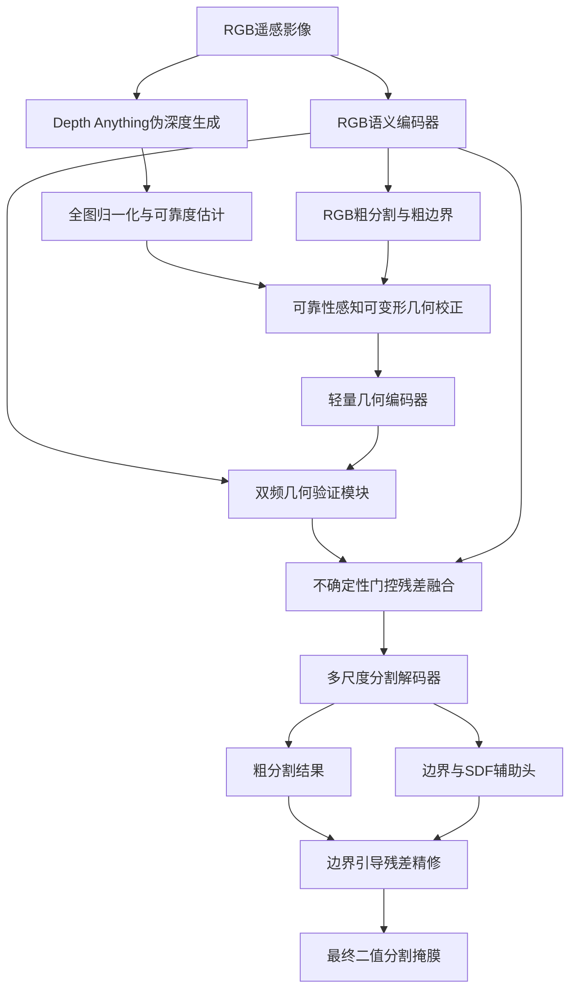

# 一、模型总体设计

模型暂命名为：

**RPGV-Net：Reliability-aware Pseudo-Geometry Rectification and Validation Network**
**可靠性感知伪几何校正与验证网络**

核心研究问题是：

> 在没有真实 DSM/DEM 的条件下，如何校正单目模型生成的不可靠伪几何，并仅在其确实有助于分割时，将其用于厂区范围补全和边界精修。

## 1. 整体结构

## 2. 输入与训练尺度

原始影像约为 \(2048\times2048\)，建议采用：

* 局部输入：\(1024\times1024\)；
* 全图缩略图：\(512\times512\)；
* 局部块重叠率：25%；
* 全图缩略图用于提取全局厂区结构 token；
* 推理时对局部 logits 加权拼接，恢复最终 \(2048\times2048\) 掩膜。

全图 token 只是保证一图一厂区条件下的整体结构，不作为论文主要创新点。

---

# 二、各模块具体实现

## 1. RGB语义主分支

为保证实现难度和实验可控性，推荐：

* 编码器：MiT-B2；
* 解码器：UPerNet 式多尺度解码器；
* 预训练：ImageNet；
* Mask2Former-Swin-T 作为强基线，而不是直接作为主模型。

对于 \(1024\times1024\) 输入，RGB 编码器输出：

| 特征      |              分辨率 | 通道数 |
| ------- | ---------------: | --: |
| \(R_1\) | \(256\times256\) |  64 |
| \(R_2\) | \(128\times128\) | 128 |
| \(R_3\) |   \(64\times64\) | 320 |
| \(R_4\) |   \(32\times32\) | 512 |

全图缩略图经过共享编码器，由最深层特征全局池化得到 \(t_g\)，通过 FiLM 调制局部特征：

$$
\widetilde R_i=\gamma_i(t_g)\odot R_i+\beta_i(t_g)
$$

RGB 分支额外产生：

* RGB 辅助分割结果 \(Z_r\)；
* 粗边界概率 \(B_r\)；
* RGB 分割不确定度：

$$
U_r=-P_r\log P_r-(1-P_r)\log(1-P_r)
$$

---

## 2. 伪深度生成与预处理

### 模型选择

建议先使用稳定、成本较低的 Depth Anything V2-Base 完成全部实验，再增加 DA3 作为深度源消融。

Depth Anything 全程冻结并离线运行，不参与端到端反向传播。

### 高分辨率生成

不建议把整幅 2048 影像直接缩放至 518。采用：

1. 全图低分辨率预测 \(D_g\)；
2. 重叠局部块预测 \(D_k\)；
3. 对每个局部深度进行 scale-shift 对齐：

$$
D_k'=a_kD_k+b_k
$$

4. 使用 Hann 权重拼接局部结果；
5. 最终得到全图伪深度 \(D_0\)。

归一化必须在整幅原始影像上完成，再裁剪训练块：

$$
D_0=\operatorname{clip}
\left(
\frac{D-P_2(D)}
{P_{98}(D)-P_2(D)+\epsilon},
0,1
\right)
$$

不能对每个训练块独立归一化，否则相邻块之间会产生尺度不一致。

### 伪深度可靠度

训练集离线进行恒等、翻转和尺度增强，预测多张深度图，先做 scale-shift 对齐，再计算方差：

$$
U_d(x)=\operatorname{Var}\left\{
T_k^{-1}[\operatorname{Align}(D(T_k(I)))]
\right\}
$$

$$
Q_0(x)=\exp[-U_d(x)/\tau]
$$

\(Q_0\) 表示 Depth Anything 在该像素上的初始可靠度。

---

## 3. 可靠性感知可变形几何校正模块 RGR

输入包括：

$$
[D_0,\nabla_xD_0,\nabla_yD_0,|\nabla D_0|,
\operatorname{Proj}(R_1),B_r,Q_0]
$$

首先将深度及其梯度编码为 32 通道特征 \(F_d\)，RGB浅层特征投影为 32 通道 \(F_r\)。

由联合特征预测可变形卷积的偏移和调制系数：

$$
\Delta p=2\tanh
\left(f_{\mathrm{offset}}([F_d,F_r,B_r])\right)
$$

偏移限制在特征空间的 \(\pm2\) 像素内，避免采样位置失控。

随后：

$$
F_d'=\operatorname{DCNv2}(F_d,\Delta p,M)
$$

校正采用受限残差形式：

$$
\widehat D=
\operatorname{clip}
\left[
D_0+\alpha Q_d\odot\tanh(f_{\mathrm{res}}(F_d')),
0,1
\right]
$$

其中：

* \(\alpha\) 为可学习系数，初始化为 0.1；
* \(Q_d=Q_0\odot Q_{\mathrm{learn}}\)；
* \(Q_{\mathrm{learn}}\) 为校正模块预测的任务可靠度。

这样模型只能对原始深度进行小范围修正，不能将深度分支直接训练成另一张分割掩膜。

---

## 4. 轻量几何编码器

将校正后的伪深度转换成几何描述：

$$
G_0=[
\widehat D,
\partial_x\widehat D,
\partial_y\widehat D,
|\nabla\widehat D|,
\nabla^2\widehat D,
R_3(\widehat D),
R_7(\widehat D),
Q_d]
$$

其中局部起伏量为：

$$
R_k(\widehat D)=
\widehat D-\operatorname{AvgPool}_k(\widehat D)
$$

不建议计算表面法向量，因为正射遥感影像通常缺少可靠的透视相机模型。

几何编码器采用轻量深度可分离卷积：

| 特征      |              分辨率 | 通道数 |
| ------- | ---------------: | --: |
| \(G_1\) | \(256\times256\) |  32 |
| \(G_2\) | \(128\times128\) |  64 |
| \(G_3\) |   \(64\times64\) | 128 |
| \(G_4\) |   \(32\times32\) | 256 |

几何分支输出辅助几何分割结果 \(Z_g\)，仅用于辅助损失和门控学习，不作为最终输出。

---

## 5. 双频几何验证模块 DFGV

使用一级二维 DWT，而不是全局 FFT。DWT 保留空间位置，更适合边界任务。

先将 \(R_1\) 与 \(G_1\) 投影到相同通道：

$$
(L_r,H_r)=\operatorname{DWT}(R_1)
$$

$$
(L_g,H_g)=\operatorname{DWT}(G_1)
$$

其中：

* \(L\)：LL 低频分量；
* \(H=\{LH,HL,HH\}\)：三个高频分量。

### 高频边界验证

$$
W_h=\sigma\left(
f_h[H_r,H_g,|H_r-H_g|,Q_d,B_r]
\right)
$$

$$
\Delta F_h=Q_d\odot W_h\odot\operatorname{Proj}(H_g)
$$

高频几何只在以下条件下介入：

* 深度可靠；
* RGB 与几何边缘具有一致性；
* RGB 主分支认为该区域接近边界。

### 低频区域验证

$$
W_l=\sigma\left(
f_l[L_r,L_g,|L_r-L_g|,Q_d,U_r]
\right)
$$

$$
\Delta F_l=Q_d\odot W_l\odot\operatorname{Proj}(L_g)
$$

低频部分主要解决：

* 主体范围缺失；
* 厂区外围漏分；
* 局部预测缺乏整体结构的问题。

经过逆小波变换得到浅层边界修正特征，同时将低频特征继续下采样到 \(1/16\) 尺度，参与整体区域验证。

---

## 6. 不确定性门控残差融合 UGRF

不采用 RGB 与伪深度直接 concat。伪深度来自 RGB，不是独立传感器，因此必须采用非对称融合。

门控输入为：

$$
[R_i,G_i,|R_i-G_i|,Q_d,U_r,|P_r-P_g|]
$$

门控权重：

$$
W_i=Q_d\odot
\sigma\left(f_i(\cdot)\right)
$$

融合结果：

$$
X_i=R_i+W_i\odot\Delta F_i
$$

只在两个位置融合：

* \(1/4\) 尺度：高频边界修正；
* \(1/16\) 尺度：低频结构补全。

不建议在四个编码阶段全部融合，否则参数量增加且容易造成伪深度污染。

### 门控监督

根据 RGB 专家和几何专家的像素误差生成软门控目标：

$$
W^*=
\sigma\left(
\frac{\ell_r-\ell_g}{T}
\right)
$$

$$
L_{\mathrm{gate}}=
\operatorname{BCE}
\left(W,\operatorname{stopgrad}(W^*)\right)
$$

当几何分支比 RGB 分支更准确时，门控应增大；反之应退回 RGB。

---

## 7. 解码与最终分割输出

融合后的多尺度特征统一投影到 128 通道，全部上采样至 \(1/4\) 尺度，拼接并通过两层卷积，得到解码特征 \(F_{\mathrm{dec}}\)。

内部设置三个头：

1. 粗分割头：输出 \(Z_c\)；
2. 边界辅助头：输出 \(\widehat B\)；
3. SDF辅助头：输出 \(\widehat S\)。

边界和 SDF 用于生成最终残差：

$$
G_b=\sigma\left(
f_b[\widehat B,1-|\widehat S|,U_c,Q_d]
\right)
$$

$$
\Delta Z=f_{\mathrm{refine}}
[F_{\mathrm{dec}},Z_c,\widehat B,\widehat S]
$$

$$
Z_{\mathrm{final}}=Z_c+G_b\odot\Delta Z
$$

最终输出：

$$
P_{\mathrm{final}}=\sigma(Z_{\mathrm{final}})
$$

$$
M_{\mathrm{final}}=
\mathbb I(P_{\mathrm{final}}>0.5)
$$

因此推理阶段的唯一输出是：

$$
\boxed{2048\times2048\text{ 污水处理厂二值分割掩膜}}
$$

---

# 三、损失函数设计

主分割损失统一采用 BCE+Dice：

$$
L_{\mathrm{seg}}=
0.5L_{\mathrm{BCE}}+0.5L_{\mathrm{Dice}}
$$

总损失建议初始化为：

$$
\begin{aligned}
L={}&L_{\mathrm{final}}
+0.3L_{\mathrm{rgb}}
+0.2L_{\mathrm{geo}}
+0.2L_{\mathrm{boundary}}\\
&+0.1L_{\mathrm{SDF}}
+0.05L_{\mathrm{reliability}}
+0.05L_{\mathrm{preserve}}\\
&+0.05L_{\mathrm{equivariance}}
+0.1L_{\mathrm{gate}}
\end{aligned}
$$

各损失作用如下：

| 损失                            | 作用                 |
| ----------------------------- | ------------------ |
| \(L_{\mathrm{final}}\)        | 监督最终分割结果           |
| \(L_{\mathrm{rgb}}\)          | 保证模型具备可靠的 RGB 退化路径 |
| \(L_{\mathrm{geo}}\)          | 使几何支路具备基础判别能力      |
| \(L_{\mathrm{boundary}}\)     | 监督内部辅助边界           |
| \(L_{\mathrm{SDF}}\)          | 保证轮廓方向和距离连续性       |
| \(L_{\mathrm{reliability}}\)  | 拟合增强一致性可靠度 \(Q_0\) |
| \(L_{\mathrm{preserve}}\)     | 防止校正深度偏离原始伪深度      |
| \(L_{\mathrm{equivariance}}\) | 保证翻转、旋转前后的几何一致性    |
| \(L_{\mathrm{gate}}\)         | 监督 RGB 与几何之间的选择    |

边界标签可由 GT 掩膜进行半径 3 像素的形态学梯度生成；SDF 截断范围建议为 \(\pm20\) 像素，并归一化至 \([-1,1]\)。

---

# 四、训练配置

## 1. 推荐参数

| 项目            | 设置                                 |
| ------------- | ---------------------------------- |
| 输入尺寸          | 局部 1024×1024，全图缩略图 512×512         |
| 优化器           | AdamW                              |
| 主干学习率         | \(6\times10^{-5}\)                 |
| 新模块学习率        | \(6\times10^{-4}\)                 |
| Weight decay  | 0.01                               |
| 学习率策略         | 1500 iter warm-up + Poly，power=0.9 |
| 有效 batch size | 8                                  |
| 训练总步数         | 约 100k iterations                  |
| 混合精度          | AMP                                |
| 推理阈值          | 验证集固定，初始为 0.5                      |
| 深度教师          | 全程冻结                               |

增强采用：

* 水平、垂直翻转；
* 90°旋转；
* 0.75–1.25随机尺度；
* 轻度颜色扰动；
* RGB、深度、标签同步进行几何变换；
* 不使用任意透视变换。

训练时以 30% 概率破坏伪深度：

* 高斯噪声；
* 高斯模糊；
* 局部块遮挡；
* scale-shift 扰动；
* 深度置零。

目的是让门控真正学会拒绝错误几何。

## 2. 三阶段训练

### 阶段一：RGB基线预训练

* 只训练 MiT-B2 + RGB 解码器；
* 约 30k–40k iterations；
* 保存性能最好的 RGB baseline。

### 阶段二：几何分支预训练

* 加载 RGB baseline；
* 冻结 RGB 编码器前两阶段；
* 训练 RGR、几何编码器、几何辅助头；
* 约 20k iterations。

### 阶段三：联合训练

* Depth Anything 保持冻结；
* 其余模块全部解冻；
* 主干使用较小学习率；
* 训练 DFGV、门控融合和最终精修头；
* 约 40k iterations。

---

# 五、完整实验任务规划

## 任务0：伪深度可用性预实验

这是继续投入前必须完成的实验。

### 深度源比较

* DA2-Small；
* DA2-Base；
* DA3单图模型；
* 可选 Depth Pro。

### 分析内容

* 深度梯度与 GT 边界的 Boundary Recall；
* 2、4、8像素容差下的边界匹配率；
* RGB Sobel 边缘、伪深度边缘和随机边缘对照；
* 不同厂区、阴影和复杂背景下的可靠度可视化。

### 简单融合验证

* RGB baseline；
* RGB+深度四通道输入；
* RGB与深度后期 concat；
* 双分支直接相加；
* 双分支普通门控。

若所有简单融合均无稳定提升，且伪深度边缘与厂区边界几乎无相关性，应暂停完整模型开发。

## 任务1：完整模型递进消融

| 编号 | 设置                 |
| -- | ------------------ |
| M0 | RGB baseline       |
| M1 | M0 + 原始伪深度直接融合     |
| M2 | M1 + RGR可变形校正      |
| M3 | M2 + 仅高频边界验证       |
| M4 | M2 + 仅低频区域验证       |
| M5 | M2 + 完整双频验证        |
| M6 | M5 + 不确定性门控融合      |
| M7 | M6 + 边界辅助头         |
| M8 | M7 + SDF残差精修，即完整模型 |

这张表将作为论文最重要的消融表。

## 任务2：关键模块横向对比

### 深度校正方式

* 不校正；
* 普通卷积；
* 空洞卷积；
* DCNv2；
* 受限残差 DCNv2，即本文方法。

### 频域方法

* 无频域；
* FFT；
* DWT-Haar；
* DWT-db2；
* DWT-db4。

### 融合方法

* Add；
* Concatenation；
* SE/CBAM门控；
* Cross-Attention；
* 本文可靠性残差门控。

不需要进行完全组合实验，每次只改变一个变量。

## 任务3：负对照实验

这是证明“模型真的使用几何”的关键。

* 正常伪深度；
* 空间打乱的伪深度；
* RGB灰度图代替伪深度；
* 全零深度；
* 强模糊深度；
* 随机噪声深度。

如果打乱深度与真实深度性能相同，就说明所谓几何提升实际上来自参数量或额外网络，而不是几何信息。

## 任务4：鲁棒性实验

对深度图逐渐施加：

* 高斯噪声；
* 模糊；
* 10%、30%、50%局部缺失；
* scale-shift 扰动；
* 全模态缺失。

比较：

* 普通融合模型；
* CMX式融合；
* RPGV-Net。

理想结果是伪深度越差，模型门控越接近零，性能逐步退回 RGB baseline，而不是显著低于 RGB baseline。

## 任务5：边界专项模型对比

除主流语义分割基线外，建议选择3个边界方法：

* PointRend；
* FDEG-Net；
* PEEN或GSCNN。

这样可以证明模型提升并非单纯来自边界监督，而是伪几何验证与融合。

## 任务6：公开数据集验证

强烈建议增加 ISPRS Potsdam 或 Vaihingen：

1. 训练时仍然只输入 RGB；
2. 使用 Depth Anything 生成伪深度；
3. RGB-only 为基础对照；
4. RGB+伪深度为本文设置；
5. RGB+真实 DSM 作为 oracle 上限。

---

# 六、评价指标

## 常规指标

* 目标类别 IoU；
* mIoU；
* Precision；
* Recall；
* F1/Dice；
* OA。

二分类任务不能只报告 mIoU，因为大面积背景可能抬高结果，必须突出目标 IoU 和目标 Recall。

## 边界指标

* Boundary IoU；
* Boundary F1；
* HD95；
* ASSD；
