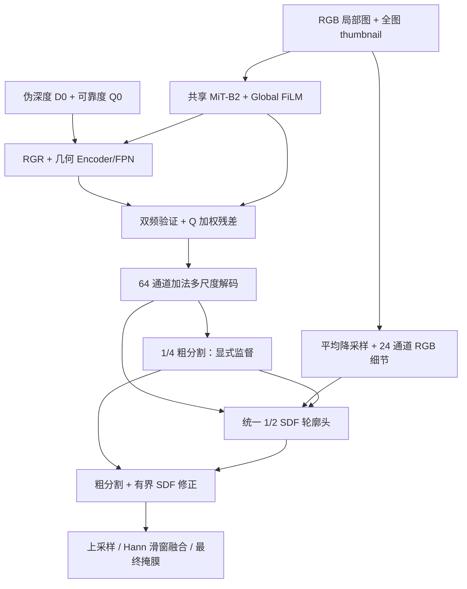

# RPGV-Net v2：实验诊断、结构改进与训练入口

本次只使用 WWTP 的训练日志、消融记录、验证集预测以及已有 workflow 分析，没有使用 Potsdam 实验。下文第 1–6 节保留早期结构设计依据；第 7–9 节为当前单阶段联合训练方案。旧分阶段实验已经存在，新方案尚未完成正式训练，不能声称其精度已经提升。

## 1. 先统一实验来源

当前仓库里存在三个不同来源，不能直接混为一个“full”结果：

| 来源 | checkpoint / 阶段 | Val foreground IoU | 用途 |
| --- | --- | ---: | --- |
| 原始 full / 消融汇总 | stage3_joint / 40000 | 76.8698% | 原消融对照 |
| 当前推理图库 | restart_30k / best iter_6000 | 77.3610% | 本次验证集形态统计 |
| `analysis/rpgv_wwtp_000149_case1` | 原始 stage3 / iter_40000 | 单个验证图的 1024 局部窗口 | 内部响应分析 |

当前推理图库中的最佳对比模型 DeepLabV3+ 的 Val IoU 为 67.7401%，RPGV 高 **9.6209 个百分点**。其他模型的权重与验证分数见 `work_dirs/wwtp_inference_gallery/manifest.json`。这支持保留已有 RGB + 全局上下文 + 受控几何架构，不宜仅为简化而整体推倒。

更新后 RPGV 已有 Test IoU 77.7362%、Dice 87.4737%、Precision 84.8328%、Recall 90.2843%、Boundary F1 16.9941%、HD95 125.2840 m。来源是 `work_dirs/rpgv_stage3_restart_30k/test_eval/20260921_130631.json`，同目录配置和日志确认加载 best iter_6000。这里只引用已完成的总体评测；本次没有在测试集上选择后处理阈值或调参。

## 2. 问题的量化依据

使用已保存的 304 张验证掩膜，在原始分辨率统计 8 连通区域；小连通块定义为面积 <256 px，仅作为诊断尺度。孔洞为不接触图像外部或 ignore 区的背景连通块。

| 验证集统计 | GT | RPGV | DeepLabV3+ |
| --- | ---: | ---: | ---: |
| 前景连通块总数 | 267 | 845 | 4337 |
| 小于 256 px 的前景块 | 0 | 149 | 3117 |
| 封闭孔洞数 | 0 | 195 | 2444 |
| 孔洞像素总数 | 0 | 243148 | 665972 |
| 完全不与 GT 相交的预测块 | — | 502 | 3286 |
| 上述孤立误检块的像素数 | — | 5839507 | 12732408 |
| 50 张负样本中出现任意误检的图数 | — | 0 | 6 |

RPGV 误检像素总计 17790378，漏检 9602196；其中 **32.82% 的误检像素来自完全游离于 GT 的块**。其余误检包含附着于主体的外扩、毛刺等，不能用“删除小连通块”统一解决。502 个游离块也并非都很小。

两个结论：

1. RPGV 已显著改善区域完整性，但“孔洞 / 碎片 / 外扩”确实还存在，不只是显示缩放造成的视觉印象。
2. 负样本没有误检，问题更集中在正样本场景中的范围定位。GT 有 267 个连通区域、254 张正样本，因此不能假设每张图恰好一个目标，也不应固定只保留最大区域。

逐图统计与 checkpoint 来源见 [验证集诊断 JSON](analysis/rpgv_v2_validation_topology.json)。重现：

```bash
python tools/analyze_wwtp_topology.py \
  --output docs/analysis/rpgv_v2_validation_topology.json
```

## 3. workflow 与代码暴露的问题

### 两级精修没有被严格限制在边界

旧模型的 1/4 精修、1/2 细节精修分别学习空间 sigmoid 门控，并叠加无幅度限制的 logit residual。`tanh` 限制的是上游几何特征残差，不是这两个最终 logit residual。

在 `wwtp_000149` workflow 窗口，两个门控的均值分别为 0.6016、0.5825；5% 分位数也分别有 0.4747、0.5137。这说明该窗口里的精修并非稀疏地集中在轮廓。RGB 纹理可以通过细节分支影响大面积预测。此处是代码机制与单窗口证据，尚不能证明其为全数据集唯一误差来源。

### 辅助形状学习与最终输出约束不足

旧 SDF 只在 1/4 尺度做辅助回归，再作为门控 / 自由残差的输入。边界监督主要施加到独立边界头，最终掩膜仍只优化 BCE + Dice；因此辅助头变好并不必然使最终阈值轮廓更干净。`coarse_head` 没有独立 coarse loss，难以明确约束“语义主体由粗分割负责、轮廓由小幅修正负责”。

### 几何有用，但响应强不等于最终贡献大

workflow 图中 corrected depth 与 Haar boundary contribution 有明显纹理响应。对该窗口的 NPZ 直接比较：

- Final 与同一联合权重下 RGB fallback 的概率 MAE：0.00338671。
- 阈值 0.5 后仅 1831 / 1048576 个像素变化，约 0.175%。
- learned reliability 均值 0.9265，5%–95% 为 0.9198–0.9329。

这些数字不等于“几何无效”：它只是旧 checkpoint 的一个局部窗口，fallback 也不是独立训练的 RGB 基线。可靠度主要拟合几何有效性，不是逐像素分割收益。保留 RGR、可靠度与双频验证，同时给 **深度校正增量** 加轻量平滑监督，比直接删掉几何更稳妥。

### 消融记录存在训练预算混杂

原 full 联合训练到 40000，而 no_frequency、no_detail、no_geometry、unweighted 实际日志只到 4000，最佳点多为 1000；其他变体约 5000–8000。它们不能严格证明每个模块各贡献多少百分点。

`tools/train.py` 默认注入的 EarlyStoppingHook 是 `min_delta=1.0, patience=3`；这会将不足 1 个 IoU 百分点的进步计入“未显著改善”。v2 配置显式指定 `min_delta=0.0, patience=20`，在 40k、2k 验证间隔下保留完整比较预算。v1 文件和历史结果保持可复现；正式公平比较也应为 v1 设置同样预算。

## 4. v2 结构



保留：MiT-B2、全图 FiLM、RGR、几何 Encoder/FPN、Haar / 深层区域验证、可靠度残差融合、几何 dropout、三阶段训练、Hann 滑窗。

替换：

- 原 4×128 通道拼接 + 密集 3×3 解码器 → 4 级投影到 64 通道，求平均后用深度可分离块融合。
- 两级精修、两个自由残差和两个学习门控 → 一个 1/2 尺度 SDF 轮廓头；无独立边界预测头参与最终精修。
- RGB 细节入口先平均降采样，再卷积，减弱逐像素纹理混叠。

令 `Zc` 为上采样后的粗 logit，`S` 为半分辨率 SDF logit：

```text
U = stop_gradient(binary_entropy(sigmoid(Zc)))
Zfinal = Zc + 2.0 × U × tanh(S)
```

SDF 正值对应前景，负值对应背景。修正幅度最多 2 个 logit，粗分割越确定，修正幅度越小；SDF 输出零初始化，初始输出严格等于粗分割。门控不接受可靠度，因此 Q=0 时几何仍严格退化到 RGB 主路径。

这不是保证连通性或消除所有孔洞的拓扑算法。尤其是高置信度的大型语义误检，仍需靠语义训练改善，不能期待轮廓头独自修复。推理没有面积过滤、强制填洞、CRF 等后处理。

## 5. v2 训练监督

主分割、RGB / 几何辅助、可靠度、深度保持与翻转等变损失沿用 v1。新增或替换如下：

| 项目 | 固定权重 | 作用 |
| --- | ---: | --- |
| coarse BCE + Dice | 0.3 | 粗预测直接学习完整语义；面积平均软标签保留小结构占比 |
| 最终概率的同类邻域一致性 | 0.1 | 仅对 GT 同类相邻像素约束概率变化，降低内部孔洞和额外边缘 |
| 最终概率的有符号边界差分 + RGB 边界辅助 | 合计 0.2，二者平均 | 直接约束最终轮廓；保留供 RGR 使用的 RGB 边界监督 |
| 半分辨率 SDF Smooth L1 | 0.1 | 轮廓带加权；截断 10 个半分辨率像素，仍约等于原图 20 px |
| 校正增量的边缘感知平滑 | 0.02 | 约束 `D_corrected-D0` 的局部振荡；D0 已有强边缘处减弱平滑 |

邻域损失将同类邻接与 GT 边界邻接分别归一化；同类项不会跨真实 GT 边界做平滑，边界项保留有符号的前景/背景转换。它是局部一致性约束，不是连通块数或拓扑不变量损失。

新损失以 FP32 计算并处理 ignore mask。SDF 对全背景 / 全前景分别使用 -1 / +1 常量；不把图像裁剪边界或 ignore 当成已知背景轮廓，并屏蔽未知区域附近的距离监督。这些系数在单阶段训练期间保持固定；设为 0 则完全关闭该损失。它们是合理的起始配置，尚未经过系统调参验证。

## 6. 参数量与兼容性

使用正式配置实际构建模型后计数：

| 范围 | v1 | v2 | 减少 |
| --- | ---: | ---: | ---: |
| 解码 + 精修 | 1216216 | 81274 | 93.32% |
| 总参数 | 27139033 | 26004091 | 4.18% |

主要参数仍在 MiT-B2；不能把 93.32% 说成整个模型压缩率。没有测量全分辨率 FPS、显存峰值或 FLOPs，因此不声明对应加速比例。

实现：

- `wwtpseg/models/segmentors/rpgv_net_v2.py`：独立注册的 `RPGVNetV2`、新监督。
- `wwtpseg/models/utils/rpgv_v2_modules.py`：轻量解码与统一轮廓头。
- v1 只提取了 `_build_prediction_modules` 构建钩子；原模块名、参数形状和前向保持原样。
- 新单阶段标准配置使用固定损失系数，不创建可学习损失参数；训练不复用历史阶段或先前可学习系数方案的 checkpoint。
- v1 的 decoder / refiner 不兼容 v2，不能直接把旧权重当作已训练 v2。

## 7. 单阶段联合训练、固定损失系数与早停

旧消融中，去掉 RGR 后独立几何分支 IoU 从 40.18% 降到 21.86%，最终 IoU 仅下降 0.07 个百分点（用户提供的当前结果）。这说明几何分支收益没有充分传递到最终分割，可能存在 RGB / 融合路径的补偿；它尚不能单独证明阶段一主分支造成了优化偏置。

当前配置 `configs/experiments/rpgv_v2_joint.py` 直接继承基础模型、五通道数据集和优化设置，从 iteration 1 联合训练 RGB、RGR、几何编码、DFGV、融合、解码与轮廓模块。`training_stage='joint'` 仅用于前向与梯度路径选择，不表示先训练其他阶段。`load_from=None`，没有 `required_previous_stage`，不读取阶段 checkpoint 环境变量。MiT-B2 保留 ImageNet 初始化；其他参数随机或按模块既定规则初始化。去掉旧 stage3 对 decoder/refiner 等模块的 0.25 学习率倍率，仅保留预训练骨干 0.1 倍率。

所有启用的损失系数保持固定，`learnable_loss_weights=False`，总损失是各项损失的加权和，不含不确定性权重的可学习参数或正则项。

| 损失项 | 固定系数 |
| --- | ---: |
| 最终分割 | 1.0 |
| RGB 辅助分割 | 0.2 |
| 几何辅助分割 | 0.2 |
| 粗分割 | 0.3 |
| RGB 边界辅助 | 0.1 |
| 最终边界差分 | 0.1 |
| SDF | 0.1 |
| 区域一致性 | 0.1 |
| 可靠度监督 | 0.05 |
| 深度保持 | 0.05 |
| 翻转等变 | 0.05 |
| 校正增量平滑 | 0.02 |

主分割保持最高系数，RGB / 几何辅助系数相同，结构和几何正则保持较小系数。相同系数并不意味着实际梯度大小相同；这些是待验证的起始值，不是已调优最优值。配置中的 `loss_weights.boundary=0.2` 在 v2 内部除以 2，所以 RGB 边界辅助的实际系数是 0.1。消融删除的损失保持关闭，不重新归一化其他系数。

默认最大 100k iterations，每 2k 验证一次，使用一次连续 warmup + poly 衰减。所有组使用同一 `RPGVEarlyStoppingHook`：监控 `binary/Foreground_IoU`（百分数刻度），`rule='greater'`、`min_delta=0.1`、`patience=5`、`strict=True`。连续 5 次验证未达到相对最近有效提升基准 0.1 个百分点的提升便停止，约对应 10k iterations 的等待窗口。只要验证 IoU 创新高，checkpoint 仍会更新，即使提升不足早停阈值。

该 hook 继承 MMEngine 的早停规则，并在恢复时重放当前 checkpoint 迭代之前的验证日志以恢复 patience，不读未来迭代记录。非有限指标会报错，不记为正常早停。调度器同时检查验证历史确实满足早停规则，记录实际迭代与 `stopped_early`，正常早停结果可评估、汇总，异常中断则不算完成。

100k 对应旧 40k + 20k + 40k 的总迭代上限，但各组实际训练长度可能不同，单次联合迭代的计算成本也不同；报告中应披露实际迭代数，不声称训练步数或计算量相等。保持 1024 crop、512 thumbnail、batch=1、梯度累积=8。

```bash
docker compose run --rm wwtp bash scripts/train_rpgv_v2.sh
# 同一次训练中断后恢复（包括优化器、学习率和早停计数）：
python tools/train.py configs/experiments/rpgv_v2_joint.py \
  --work-dir work_dirs/rpgv_v2_joint_fixed --resume
```

默认工作目录为 `work_dirs/rpgv_v2_joint_fixed`，可用 `RPGV_V2_WORK_ROOT` 指定新目录。旧 `scripts/train_rpgv_v2_stages.sh` 转发到此单阶段入口。旧阶段配置与固定权重行为保留用于历史诊断及兼容其他模型；新标准配置和全部 v2 消融配置均使用固定系数与统一早停。

## 8. 递进式与单项删除消融

默认六组递进式消融是模块组合递进，**训练之间没有权重继承**：

| 组 | 配置名 | 在前一行结构上增加 |
| --- | --- | --- |
| 基础 RGB + 原始几何 | `progressive_base` | 原始 D0 / Q0、几何辅助分支、直接无权重融合；关闭 RGR、DFGV、轮廓修正和最终结构约束 |
| + RGR | `progressive_rgr` | 深度校正与学习可靠度，以及对应辅助损失 |
| + DFGV | `progressive_dfgv` | 双频几何验证 |
| + 可靠度加权 | `progressive_weighted` | 融合残差上的 Q 缩放 |
| + 轮廓修正 | `progressive_contour` | SDF 对最终 logit 的直接修正 |
| + 结构约束（Full） | `full` | 最终概率的区域一致性和边界差分损失 |

基础行不是纯 RGB。所有行保留全局上下文、粗分割、SDF 与 RGB 边界辅助监督；无轮廓修正仅关闭 SDF 对最终输出的直接修正。每组对保留的损失使用相同固定系数。递进差值表示该组合下的条件增益，不能等同于模块独立贡献。

`--variants paper` / `core` 提供 Full + `no_rgr`、`no_frequency_validation`、`unweighted_fusion`、`no_contour`、`no_structure_regularization` 六组单项删除对照，全部从头联合训练。`--variants all` 运行两套去重后的 11 组。Full 也必须重新训练，不能沿用旧分阶段结果。所有行使用相同种子、最大预算、早停规则、数据和初始化策略；默认 seed=42，可用 `--seeds 42 43 44` 做重复实验。

## 9. 执行、评估与验证

```bash
# 生成六组独立配置与清单，不训练
python scripts/run_rpgv_v2_ablations.py plan
# 串行训练；中断后加 --resume-incomplete
python scripts/run_rpgv_v2_ablations.py run
python scripts/run_rpgv_v2_ablations.py evaluate --split val
python tools/summarize_rpgv_v2_ablations.py work_dirs/rpgv_v2_single_stage_fixed --split val
# 固定实验设计后评估测试集，checkpoint 仍由验证集选取
python scripts/run_rpgv_v2_ablations.py evaluate --split test
python tools/summarize_rpgv_v2_ablations.py work_dirs/rpgv_v2_single_stage_fixed --split test
```

若改预算，plan/run 都传相同的 `--max-iters`（至少 2000 且为 2000 的倍数），scheduler 终点同步更新。结果位于 `work_dirs/rpgv_v2_single_stage_fixed/single_stage/seed_<seed>/<variant>/joint/`，不改动历史结果及旧可学习系数方案的计划。`paper_reuse` / 旧 `full` / 旧 `joint` 协议与 `--stage2-checkpoint` / `--source-root` 参数已移除，误用会报错。

调度器保存配置、种子、预算、源码指纹和 checkpoint SHA256；配置或代码改变须使用新目录。断点恢复只接受当前变体自己目录内的 checkpoint。达到最大预算或正常早停且有完成记录的结果才进入统计；缺失测试结果不会用验证分数代替。输出 md/csv/json、递进表 `_progressive.md` 和单项删除表 `_paper.md`；`delta_previous_val_iou` 按同种子、同最大预算与递进前一行配对，`delta_val_iou` 相对 Full。主表报告 IoU、Boundary F1 和 HD95；孔洞、游离误检作为辅助诊断。

```bash
python tools/test_rpgv_v2_ablations.py -v
python tools/test_rpgv_v2.py -v
```

回归覆盖独立初始化、配置递进关系、所有启用模块的有限反向梯度、固定系数不参与优化、参数更新与严格 checkpoint 恢复、早停阈值/耐心计数/恢复及早停后的评估与汇总、拒绝阶段复用、预算与最佳 checkpoint 选择、仅本次训练恢复、配对统计及真实 CPU 评估入口。旧模型测试仍检查历史阶段兼容、Q=0 回退和轮廓等性质。缩小输入的工程检查不能替代完整训练；新方案的精度影响需要重新实验确定。
