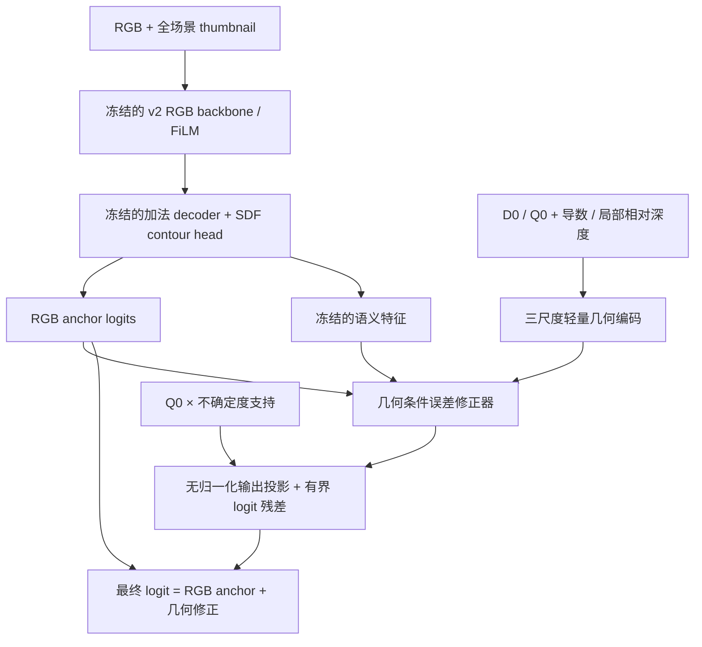

# RPGV v3：固定 RGB 基线，学习几何辅助误差修正

## 1. 当前结果并不证明几何无效

本次只读取 WWTP 实验，不使用 Potsdam。v2 stage3 仍在训练；下表对应已保存的诊断快照，不能当作最终结果。

| 模型阶段 / checkpoint | Val foreground IoU | Boundary F1 | Precision | Recall |
| --- | ---: | ---: | ---: | ---: |
| v1 stage1 最佳 / 16000 | 71.7332% | 13.5720% | 79.3037% | 88.2551% |
| v2 stage1 最佳 / 36000 | 75.1428% | 14.4175% | 82.0214% | 89.9600% |
| v2 stage3 / 2000 | 69.9823% | 12.9073% | 75.2622% | 90.8890% |
| v2 stage3 当前最佳 / 4000 | **76.1883%** | 15.1375% | 84.8976% | 88.1330% |
| v2 stage3 / 10000 | 75.7931% | 15.3869% | 83.9273% | 88.6623% |
| v2 stage3 / 14000 | 74.3857% | 14.4239% | 80.5471% | 90.6754% |

stage3 已经在 4k 和 10k 超过 stage1；其最佳点高 **1.0454 个百分点**。更准确的观察是联合训练波动较大、增益没有稳定保持。v1/v2 stage1 的训练预算与提前停止规则也不同，不能将它们的全部差异归因于结构修改。

快照与完整验证曲线数据：[阶段日志快照](analysis/rpgv_v2_stage_snapshot.json)。stage2 的几何辅助分割最佳 IoU 为 40.1800%，Precision 45.0981%；这说明它不是强独立分割器，但低独立精度不排除其为 RGB 提供互补信息。

## 2. 同 checkpoint 几何开关诊断

为避免干扰正在满负载运行的 L4 GPU，本次诊断使用限制为 2 核的 CPU 容器。按验证集文件名排序、均匀索引固定取 6 张图，每张取原始分辨率中央 1024×1024 窗口；各分支共享同一个 512 全场景 token 和 RGB 特征。没有按效果挑图，也没有使用测试集。

| checkpoint | 几何开启窗口 IoU | 同权重 RGB 回退 IoU | 开启几何的差值 |
| --- | ---: | ---: | ---: |
| v2 stage1 / 36000 | 84.5344% | 84.5344% | 0 |
| v2 stage3 / 4000 | 71.0761% | 70.3394% | **+0.7367 pp** |
| v2 stage3 / 14000 | 84.5321% | 83.9664% | **+0.5656 pp** |

窗口 IoU **不是完整滑窗验证 IoU**。尤其 4k checkpoint 在这几个窗口的排序与全验证集不同，显示小样本诊断的局限。这里能支持的是：几何分支不是恒等 / 死分支，在这些固定窗口提供了正增益；不能从中推断其完整验证集贡献大小。

同时逐张量检查：stage2 的所有 RGB 主干、FiLM、解码和轮廓头权重与 stage1 最佳权重 **完全相同**。阶段衔接没有丢失 RGB 权重。

相对于 stage1，stage3 的权重相对 L2 变化为：

| 参数组 | 4k | 14k |
| --- | ---: | ---: |
| RGB backbone | 1.1640% | 2.0763% |
| Global FiLM | 15.1016% | 27.1573% |
| Decoder | 2.0758% | 3.7281% |
| Contour refiner | 0.7933% | 1.5187% |

权重变化不等于性能损害，尤其 FiLM 的相对范数依赖其初始尺度。它说明“stage3 对 stage1 的比较”混合了 RGB 更新和几何注入两个变量。详见 [逐图诊断与参数变化](analysis/rpgv_v2_geometry_diagnostic.json)、`tools/diagnose_rpgv_geometry.py`。

## 3. v2 的可改进机制

1. **联合训练没有固定 RGB 参照。** 几何融合、主分割、RGB 辅助、几何辅助同时训练；几何辅助通过 RGR 的 RGB 输入也能反传到 backbone。即使几何提供小收益，总体模型也可能因 RGB 路径更新而波动。这是可检验的优化假设，不是已经证明的唯一根因。
2. **几何预训练目标与实际需求不同。** stage2 让几何独立重建整张 GT，而目标更应该是补充强 RGB 预测的缺失信息。
3. **零初始化不保证训练初期小扰动。** 原特征融合投影后接 GroupNorm 再 tanh。虽然第零步严格为零，小的投影权重更新仍可能经归一化产生较大残差；应通过实际响应测量验证，而不能仅凭零初始化假设渐进融合。
4. **重新启动的联合学习率高于 stage1 末期。** 原 stage3 对 backbone 使用 6e-5 峰值、对原解码器使用 1.5e-4 峰值；这与从接近零的 stage1 末期继续训练不同。

因此 v3 优先解决“固定强基线、明确几何的增量任务和贡献归因”，而不是继续增加独立几何任务或门控。

## 4. v3 架构



复用并冻结 v2 RGB 最佳 checkpoint 的 MiT-B2、FiLM、解码器和轮廓头；训练时这些模块始终 eval，不启用 DropPath，也不保存反向计算图。没有第二套教师模型。

移除在线 RGR、几何辅助分割头、几何 FPN、Haar 验证与两处 RGB 特征融合。新模块在 1/4、1/8、1/16 三个尺度读取深度描述符，并结合冻结语义特征、RGB 概率和不确定度，预测 logit 修正。

```text
delta = 3 × tanh(adapter_output)
support = Q0 × (0.2 + 0.8 × entropy(sigmoid(Zrgb)))
Zfinal = Zrgb + correction_strength × support × upsample(delta)
```

输出投影是无后置归一化的普通 1×1 Conv，零初始化。因此初始化输出精确等于 RGB 基线；`Q0=0` 或 `correction_strength=0` 时始终退回该基线。0.2 的支持下限允许修正器尝试纠正有一定置信度的错误；最大修正仍限制在 3 个 logit，无法保证纠正极高置信度的大错误。

**冻结的是 RGB 基线，不是保证最终指标永远不下降。** 几何修正仍可能在未知图像引入误差，因此必须同时评估同权重 RGB 回退和完整输出。

实际构建计数：总参数 **25,356,181**，可训练参数 **9,433**。v2 总参数为 26,004,091。没有测量实际 FPS / 显存收益，也不将冻结参数比例等同于速度提升。

## 5. 训练目标与对照

只训练 adapter，一次 12k 迭代实验即可，不需要再做独立几何分割预训练。AdamW 学习率 2e-4、500 步 warmup、梯度累积 8；这些是起始设置，未验证为最优超参数。

| 损失 | 权重 | 意义 |
| --- | ---: | --- |
| 最终 BCE + Dice | 1 | 保持整体分割目标 |
| RGB 错误加权 BCE | 0.25 | 用冻结 RGB 的 `abs(p-y)` 加权，专注其有改进空间的区域 |
| RGB 正确像素保护 | 0.5 | 在 RGB 原本判对的像素上惩罚 `relu(BCE_final - BCE_rgb)` |
| 最终轮廓差分 | 0.1 | 直接约束最终预测的 GT 边界 |
| 同类邻域一致性 | 0.05 | 减少区域内额外边缘；不跨真实 GT 边界平滑 |

训练仍使用已有深度破坏增强和 10% 几何 dropout；GT 只参与训练监督，不进入推理支持图。新增日志 `anchor_bce`、`correction_abs` 分别记录固定基线误差和修正幅度。

`configs/v3/ablations/` 提供：

- `rgb_adapter_control.py`：完全隐藏 D0 和 Q0，用 RGB 灰度及其导数替代深度描述符、令质量权重为 1；保留同一修正模块容量，仅用 RGB 信息。这样没有因输入全零而让部分参数失去作用。用于区分“更多参数 / 再训练的收益”与真正的几何收益。
- `no_rgb_protection.py`：去掉对原本正确 RGB 像素的保护。
- `no_error_focus.py`：去掉 RGB 错误加权项。

三者都应加载**同一个 v3 init checkpoint**、同种子、同训练预算，并分别保存到独立工作目录。如果纯 RGB adapter 对照与完整 v3 一样好，就不能声称主要增益来自伪几何。还可补充深度打乱实验检查对齐几何的贡献。

## 6. 初始化、训练和评估

新类独立注册为 `RPGVNetV3`，v1 / v2 的前向、配置和正在训练的进程未修改。默认使用 v2 stage1 最佳 RGB 权重，避免从已经被联合训练改变的 RGB 分支开始。

```bash
# 当前 v2 实验结束后再启动，避免争抢 GPU。
docker compose run --rm wwtp bash scripts/train_rpgv_v3.sh
```

脚本默认读取当前验证选择的 `work_dirs/rpgv_v2_staged/stage1_rgb/best_binary_Foreground_IoU_iter_36000.pth`，创建 `work_dirs/rpgv_v3_adapter/init.pth` 并训练。通过 `RPGV_V3_RGB_CHECKPOINT` / `RPGV_V3_WORK_ROOT` 可指定其他来源和输出目录；已有目录会拒绝覆盖。

手动初始化 / 恢复：

```bash
python tools/initialize_rpgv_v3.py PATH_TO_V2_RGB_BEST work_dirs/rpgv_v3/init.pth
RPGV_V3_INIT_CHECKPOINT=work_dirs/rpgv_v3/init.pth \
  python tools/train.py configs/v3/rpgv_v3_adapter.py --work-dir work_dirs/rpgv_v3
python tools/train.py configs/v3/rpgv_v3_adapter.py --work-dir work_dirs/rpgv_v3 --resume
```

初始化工具严格检查全部保留模块的权重覆盖与形状，输出来源 SHA256 和键记录，不迁移旧优化器。模型含持久化初始化标记，防止直接冻结随机 RGB 模型进行训练。

训练后进行**完整验证集、同 checkpoint**的基线 / 修正结果比较：

```bash
python tools/evaluate_rpgv_v3.py PATH_TO_V3_BEST \
  --output work_dirs/rpgv_v3_validation
```

工具默认验证集，运行同一 checkpoint 的 `correction_strength=0` 和 `=1` 两次原始 Hann 滑窗评估，记录 IoU、边界、距离与拓扑指标。没有强制填洞、最大连通块过滤或其他后处理。测试集应在模型选择完成后再使用 `--split test`。

## 7. 验证范围

`python tools/test_rpgv_v3.py -v` 覆盖：配置解析、模块移除及参数量、初始化完整性、RGB 初始精确等价、非零残差下 Q=0 的精确回退、有界输出、深度扰动响应、纯 RGB 对照不依赖深度/可靠度、真实 MMEngine 梯度累积和 AdamW 更新、RGB 权重更新前后逐位相同、饱和 logits、ignore mask、奇数尺寸和完整预测接口的滑窗覆盖。

本次 7 项 CPU 测试全部通过。GPU 正在执行用户的 v2 训练，因此未抢占 GPU 做 v3 CUDA AMP 测试，也没有启动 v3 正式训练。v3 的效果、边界提升和稳定性仍需以上对照实验验证。

已使用真实 v2 stage1 最佳权重生成 `work_dirs/rpgv_v3_initialization/init.pth` 及同名 JSON 来源记录。可直接将 `RPGV_V3_INIT_CHECKPOINT` 指向此文件启动独立训练，无需重新训练 RGB 主路径。
