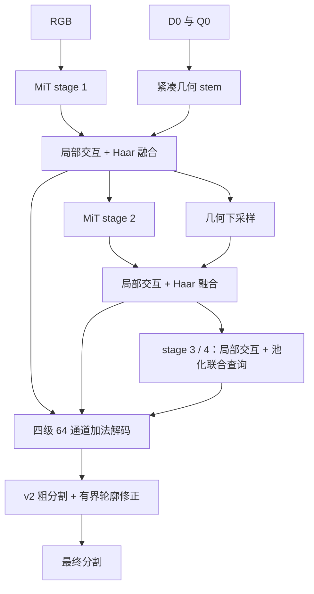

# RPGV v4：面向最终分割的几何融合与单阶段训练

v4 基于 v2 的 MiT-B2、轻量加法解码器、统一轮廓头与最终掩膜监督构建。几何从“先单独校正、再训练独立分割器”改为编码器内的 RGB–几何交互。**已完成工程验证，尚未完整训练；不声明 IoU 或实测训练速度提升。**

## 1. 实验依据与解释边界

读取两个实验目录的 `completed.json`，得到验证集选择的结果：

| 实验 | 阶段二几何 IoU | 阶段三最终 IoU |
| --- | ---: | ---: |
| v2 Full | 40.179994% | 78.404143% |
| v2 w/o RGR | 21.856284% | 78.331389% |
| Full − w/o RGR | 18.323710 pp | 0.072754 pp |

来源：`work_dirs/rpgv_v2_paper/full/seed_42/full/` 与 `work_dirs/rpgv_v2_paper_reuse/paper_reuse/seed_42/no_rgr/` 的 `stage2_geometry/completed.json`、`stage3_joint/completed.json`。

RGR 的独立几何收益没有充分体现在最终分割上，RGB 和后续融合可能补偿了几何退化。这是结构修改的依据，不是“几何无用”的证明，也不是跨种子显著性结论。几何不再承担必须独立完成分割的目标。

## 2. 与 DFormer 的关系

参考 [DFormer 官方仓库](https://github.com/VCIP-RGBD/DFormer)及其 [原版编码器实现](https://github.com/VCIP-RGBD/DFormer/blob/main/models/encoders/DFormer.py)：采用紧凑几何流、局部乘性交互、由两种模态构成的池化查询，以及在编码过程中持续融合的思路。v4 是保留现有 MiT ImageNet 初始化的独立实现，不是 DFormer 复现，不加载 DFormer 权重，也不声称复现其 RGB-D 预训练收益。

## 3. 前向结构



- RGB 通道沿用 `[64, 128, 320, 512]`；几何通道缩为 `[16, 32, 64, 128]`。
- 每个 MiT stage 后融合；**融合后的 RGB 特征继续进入下一 stage**，而不是只在末端 decoder 上叠加残差。前三层融合也更新几何流，最后一层只输出语义特征。
- 局部交互拼接 RGB 投影 `r`、几何特征 `g` 和乘积 `r*g`。浅两层将二者的 Haar LL/LH/HL/HH 一并投影为融合特征；不再执行独立频域“验证”或预测边界可信度。
- 深两层使用最多 4×4 的 RGB–几何联合查询，读取当前层 RGB key/value，再上采样到特征分辨率；注意力规模为 `16×HW`，不构造 `HW×HW` 矩阵。此处是 crop 内上下文，不等同于额外全图 thumbnail。
- 几何 residual 使用初值 0.1 的可学习通道缩放，投影不做零初始化，确保首次反向传播就有最终分割梯度进入几何与频域路径。无需逐阶段解冻或额外损失预热。
- D0 在空间卷积前乘 Q0；每层 RGB 注入与几何状态更新均由缩放后的离线 Q0 控制。Q0=0 时输出严格等于同权重 RGB 回退；Q0=0 的局部深度值不会污染邻居。Q0 是离线置信度，不是预测的语义收益。
- 保留 v2 的有界轮廓修正、Hann 滑窗和 FP32 损失/注意力计算。3 通道输入可执行同权重 RGB 回退，5 通道使用原有 BGR+D0+Q0 数据。

删除 RGR、学习可靠度头、独立几何 encoder/FPN/分割头、RGB 辅助分割/边界头、DFGV 验证器、深度保持/平滑/翻转等变损失。几何流由主分割和共享轮廓目标端到端训练。

## 4. 单阶段训练与效率

默认配置 `configs/v4/rpgv_v4.py`：

| 项目 | 设置 |
| --- | --- |
| 初始化 | ImageNet MiT-B2；其余随机/原轮廓初始化 |
| 训练流程 | 一次联合训练，全部参数从第一个 iteration 可训练 |
| 最大预算 | 40,000 iterations，验证间隔 2,000 |
| batch | 1，梯度累积 8，有效 batch=8 |
| 优化器 | AdamW，新增模块 lr=6e-4，MiT lr=6e-5，AMP |
| 调度 | 1,500 iter 线性 warmup + polynomial decay |
| 几何 dropout | 每个样本 0.1 概率关闭 Q0，训练 RGB 回退 |
| 损失权重 | final=1、coarse=0.3、region=0.1、final boundary=0.1、SDF=0.1 |
| checkpoint 选择 | 验证集 Foreground IoU；固定预算，不注入默认早停 |

不依赖任何 v2 stage1/stage2 checkpoint；训练期间没有独立几何优化或冻结 RGB。相对 v2 40k+20k+40k，总迭代预算减少 60%，**不等于实测墙钟训练时间减少 60%**。

默认关闭全图 thumbnail 的第二次 MiT 编码，并删除对应数据打包；`with_global_context.py` 可恢复该能力，仍保持单阶段训练。去掉专门服务可靠度监督的合成几何腐蚀，保留同步五通道空间增强、RGB 光度增强和几何 dropout。SDF 仍沿用 v2 的 CPU EDT 目标生成，未声称彻底消除 CPU 开销。

正式配置参数计数：v2 **26,004,091**，v4 **24,722,666**，减少 **4.93%**。这是参数量，不是 FLOPs/FPS 测量。频域路径仅保留在浅两层，是否改善最终指标需要消融判断。

## 5. 运行与恢复

在项目的 PyTorch/MMseg 环境中运行，或通过现有 Docker 镜像：

```bash
docker compose run --rm wwtp bash scripts/train_rpgv_v4.sh
```

默认写入全新的 `work_dirs/rpgv_v4`，已存在则脚本拒绝覆盖。指定新目录：

```bash
RPGV_V4_WORK_ROOT=work_dirs/rpgv_v4_seed42 bash scripts/train_rpgv_v4.sh
```

中断恢复直接使用同一工作目录：

```bash
python tools/train.py configs/v4/rpgv_v4.py --work-dir work_dirs/rpgv_v4 --resume
```

评估验证集选出的 v4 checkpoint：

```bash
python tools/test.py configs/v4/rpgv_v4.py PATH_TO_V4_BEST_CHECKPOINT \
  --work-dir work_dirs/rpgv_v4_test
```

现有 v1/v2/v3 checkpoint **不能直接作为 v4 checkpoint 加载**；只有 MiT 的 ImageNet 初始化在默认配置中复用。v4 同结构 checkpoint 支持严格恢复；移除频域/几何的配置结构不同，须独立训练。

## 6. 最小对照组与成功标准

```bash
python tools/train.py configs/v4/no_geometry.py
python tools/train.py configs/v4/no_frequency.py
python tools/train.py configs/v4/with_global_context.py
```

三个配置与 Full v4 共享 40k 单阶段预算、随机种子、数据划分、优化器和验证选择规则。前三组（Full、no geometry、no frequency）用于判断几何和 Haar 是否提高**最终** IoU/Boundary F1/HD95；global 组评估关闭额外全图编码的精度与效率代价。无几何配置保留一致的五通道数据读取，但不构建几何模块。

另外可以用同一完整 checkpoint 比较 5 通道与仅 3 通道输入，诊断模型对几何的依赖；该回退不是独立训练 RGB 基线。v2 与 v4 的差值同时包含训练预算、结构和监督变化，不能将全部差异归因于一个融合算子。测试集只在设计固定后评估。

## 7. 工程验证

```bash
python tools/test_rpgv_v4.py -v
# 仅在 GPU 可用时验证 CUDA FP16 更新：
RPGV_V4_TEST_CUDA=1 python tools/test_rpgv_v4.py V4Test.test_cuda_amp_update -v
```

检查覆盖所有配置的联合反向/优化器更新与严格 checkpoint 恢复、最终损失单独到达四级几何/频域路径、深层特征对深度的响应、MiT 前向一致性、Q0=0 回退、局部无效深度隔离、全 ignore、几何 dropout、奇数尺寸与 Hann 滑窗。

本次 v2/v4 联合回归共 17 项：15 项通过，2 项 CUDA 检查跳过。另外使用一张现有训练图、缩小到 64×64 的输入，通过标准 `tools/train.py` 完成两次 CPU 优化更新；临时配置关闭预训练下载、验证和 checkpoint 保存，使用普通 FP32 OptimWrapper。该检查验证数据加载、预处理、loss 和训练入口衔接，不代替正式 1024×1024 AMP 训练或收敛实验。

当前 GPU 正运行其他实验，因此本次采用 CPU 检查，CUDA FP16 检查未执行；不启动或中断已有完整训练。
