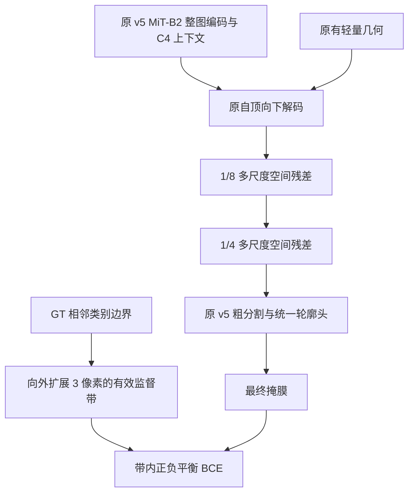

# RPGV v5.1：保留 v5 区域精度，改善局部空间完整性

本版依据已经完成的 `rpgv_v5_1m` 和 `segnext_1m` 训练构建。当前交付是**可训练、可严格迁移的 v5.1 候选及验证工具**；尚未完成 v5.1 收敛训练，不声称新架构已经提高 IoU。Astra 负责改动范围、机制判断和最终验收；GPT-6 Sol 分工完成原始训练审计、实现、权重迁移与测试。

## 1. 两个已完成实验说明什么

两组实际保存的训练配置都是 1024 整图、1 m、同一划分、seed 42、batch 2×梯度累积 4、20k micro-iterations、每 1k 全验证、whole 推理。两者的 IoU 最佳权重均在 12k。现有结果全部是 **304 张验证集**，没有把它们写成独立测试集精度。

| 指标 | v5 最佳 12k | SegNeXt 最佳 12k |
| --- | ---: | ---: |
| Foreground IoU / % | **82.2121** | 79.9888 |
| Boundary F1 @1.5m / % | 17.7149 | 17.5349 |
| HD95 / m | **51.5859** | 64.5130 |
| Precision / Recall / % | 90.3138 / 90.1620 | 88.7881 / 88.9761 |
| 小预测连通块，<64m² | 262 | 35 |
| 孔洞 | 253 | 48 |
| 脱离 GT 的误检连通块 | 249 | 69 |
| 脱离 GT 的误检像素 | 115,377 | 113,869 |

v5 的区域 IoU 高 2.2233 pp，HD95 好 12.9271 m，不能因 SegNeXt 更快就直接替换 MiT。其额外问题是很多**小碎片**：游离误检像素接近，但块数更多；不是所有误检面积都更糟。不同主干、预训练、头、损失与模态输入同时改变，这个对比不能证明碎片来自几何或某一层。

12k→20k，v5 IoU 下降 0.5014 pp，BF1 反而提高 1.3329 pp；SegNeXt 也出现类似面积/召回与边界的取舍。v5 并非没有收敛，延长同一配方未必解决问题。训练边界项在后期约为 0.094，主分割项仍在下降；这一数值平台提示目标值得修改，**损失数值占比不等于梯度占比**。

完整来源、40 次验证记录、性能与配置差异见 [训练审计](analysis/rpgv_v51_training_audit.md)、[原始汇总 JSON](analysis/rpgv_v51_training_audit.json)；旧数据实验不能与这些 1 m 结果直接相减。

## 2. 改动控制在两个可证伪假设



**假设一：局部空间建模不足是碎片原因之一。** 保留 v5 的主干、上下文、几何和轮廓接口，仅在解码器 1/8、1/4 各增加一个 64 通道模块：

```text
u = GroupNorm(F)
v = GELU(DW5×5(u) + DW1×7→7×1(u) + DW1×11→11×1(u))
F_out = F + 0.5 × tanh(Conv1×1(v))
```

空间卷积在每通道内聚合不同范围的局部信息，再以 1×1 投影混合通道，新增的 1/8 修正继续进入 1/4。这个思路参考 [SegNeXt 的多尺度卷积上下文](https://arxiv.org/abs/2209.08575)，并不是移植 MSCAN 或 Hamburger，也不声称原论文已经证明它能解决 WWTP 孔洞。

两个输出投影为零初始化，无后置归一化。迁移旧权重时 **v5.1 初始预测与 v5 完全相同**，且每次新增特征修正的幅度不超过 0.5。这个界限不保证最终预测不退化。首步梯度只进入输出投影，投影更新后内部 DW/strip 核才获得非零梯度；这是有意的稳定初始化，不是死分支。

**假设二：一像素单位跳变目标与平滑上采样输出不匹配。** v5 在 GT 相邻异类像素上要求概率差趋近 ±1；它的最终预测由半分辨率插值而来，在部分栅格对齐条件下无法表示如此陡的变化，且饱和错误概率的差分梯度可能变弱。长期接近常数不是独立的 bug 证明，但值得用简单的目标替换试验检验。

v5.1 的 `boundary_mode='band'` 用 GT 中**有效相邻像素**的类别变化生成边界，再在输入栅格向外扩展 3 像素；带内按前景/背景分别归一化 BCE。图像外框不产生人工边界，ignore 及其邻域不参与；全前景、全背景和全 ignore 返回有限零。监督作用于最终 logits，训练外不需要 GT。它是工程上的边界重加权，不是 [2019 遥感 Boundary Loss](https://arxiv.org/abs/1905.07852) 的复现。

默认保留 final BCE+Dice、0.3 coarse、0.1 SDF，以 0.05 boundary-band BCE 替代旧 0.05 region 和 0.1 unit-transition 项。区域内部与远离 GT 的误检仍由全图分割损失监督；边界带损失本身不会消除远端误检。`boundary_mode='legacy'` 完整恢复 v5 原损失，用于受控对照。

不引入最大连通块过滤、强制填洞或固定目标数量先验。GT 允许多个设施，指标变好不应靠删掉真实小目标获得。

## 3. 迁移与低成本训练方案

默认源为 `work_dirs/rpgv_v5_1m/best_binary_Foreground_IoU_iter_12000.pth`。迁移工具逐键验证 **391 个旧状态键**的完整覆盖、shape、dtype 与有限值，只允许新增 `decoder.spatial8.*`、`decoder.spatial4.*` 共 **28 个键**，随后严格加载完整 state；不迁移旧优化器、迭代数或学习率状态。源文件不修改，目标已存在就拒绝覆盖。来源 SHA256、配置哈希与键记录保存到初始化 sidecar。

当前已生成 [初始化记录](../work_dirs/rpgv_v51_initialization/init.json) 和同目录 `init.pth`。常规启动脚本会在新的训练目录内重新严格生成匹配该配置的初始化；不同消融的参数集合不同，不混用初始化文件。

| 项目 | 默认 warm start |
| --- | --- |
| 数据 | 原 1024、1 m 转换集及相同划分，增强不变 |
| 微批 / 累积 | 2 / 4，有效 batch=8 |
| 新增预算 | 6000 micro-iterations = 1500 optimizer updates = 12000 图像暴露，约 4.93 遍训练集 |
| RGB backbone 学习率 | 1e-5 |
| 旧 decoder / geometry / contour 学习率 | 1e-4 |
| 新 spatial 模块学习率 | 5e-4 |
| 调度 | 400 micro-step warmup + poly；不自动早停 |
| 验证 | 每 500 micro-steps 全 304 张；仍按 Foreground IoU 选择 |
| 精度与指标 | AMP；BF@1.5m、HD95_m、拓扑小区域 64m²，whole 推理 |

该预算是首轮假设检验，不保证完全收敛。若要增加预算，所有关键对照一致增加。已有 v5 训练及 checkpoint 选择也是成本的一部分，不能把 warm-start 6000 步包装成“从头 6000 步达到同等精度”。

## 4. 四组受控实验

| 配置 | 空间残差 | 边界目标 | 作用 |
| --- | --- | --- | --- |
| `v5_continue.py` | 无 | 原 v5 | 排除多训练 6000 步的收益 |
| `loss_only.py` | 无 | band | 单独检验监督修正 |
| `spatial_only.py` | 有 | 原 v5 | 单独检验空间模块 |
| `rpgv_v51.py` | 有 | band | 组合效果与交互 |

四组来自**同一 v5 最佳权重**，旧参数学习率、数据、更新数、seed 与验证选择一致。这些是 warm-start 受控比较，不等于独立从头消融。另提供 `from_scratch.py`：ImageNet 初始化、20k micro-steps，供后续与 v5 进行从头同预算架构比较。

建议先运行 `v5_continue` 与 full，若有价值再补两组单因素，最后只对胜出候选与对照追加不同种子。验收同时看 IoU、BF、HD95、小块/孔洞数量和面积、负样本误检与小设施召回。可预先采用“相对 matched continuation 的 IoU 下降不超过 0.2 pp，同时 BF 提高且碎片减少”的非劣化筛选门槛；若要声称精度提升，须另证实 IoU 增益及跨种子稳定性。门槛是决策规则，不是保证。

## 5. 运行

```bash
# 完整 v5.1 候选；脚本拒绝覆盖已有目录。
docker compose run --rm wwtp bash scripts/train_rpgv_v51.sh

# 相同预算的原 v5 继续训练对照。
docker compose run --rm \
  -e RPGV_V51_CONFIG=configs/v51/v5_continue.py \
  -e RPGV_V51_WORK_ROOT=work_dirs/rpgv_v51_v5_continue \
  wwtp bash scripts/train_rpgv_v51.sh

# 从已生成的初始化启动（不用再次迁移）。
docker compose run --rm \
  -e RPGV_V51_INIT_CHECKPOINT=work_dirs/rpgv_v51_initialization/init.pth \
  wwtp python tools/train.py configs/v51/rpgv_v51.py \
  --work-dir work_dirs/rpgv_v51_from_prepared_init --disable-early-stopping

# 中断恢复，保留同一结构和配方。
docker compose run --rm wwtp python tools/train.py configs/v51/rpgv_v51.py \
  --work-dir work_dirs/rpgv_v51_1m --resume --disable-early-stopping

# 独立 ImageNet 起点，不使用 warm-start 脚本。
docker compose run --rm wwtp python tools/train.py configs/v51/from_scratch.py \
  --disable-early-stopping
```

模型代码：[RPGVNetV51](../wwtpseg/models/segmentors/rpgv_net_v51.py)、[空间模块](../wwtpseg/models/utils/rpgv_v51_modules.py)。检查入口：[单元/集成回归](../tools/test_rpgv_v51.py)、[同 checkpoint 验证诊断](../tools/diagnose_rpgv_v51.py)、[严格迁移](../tools/initialize_rpgv_v51.py)。本轮不启动耗时数小时的正式训练，不评估测试集。
