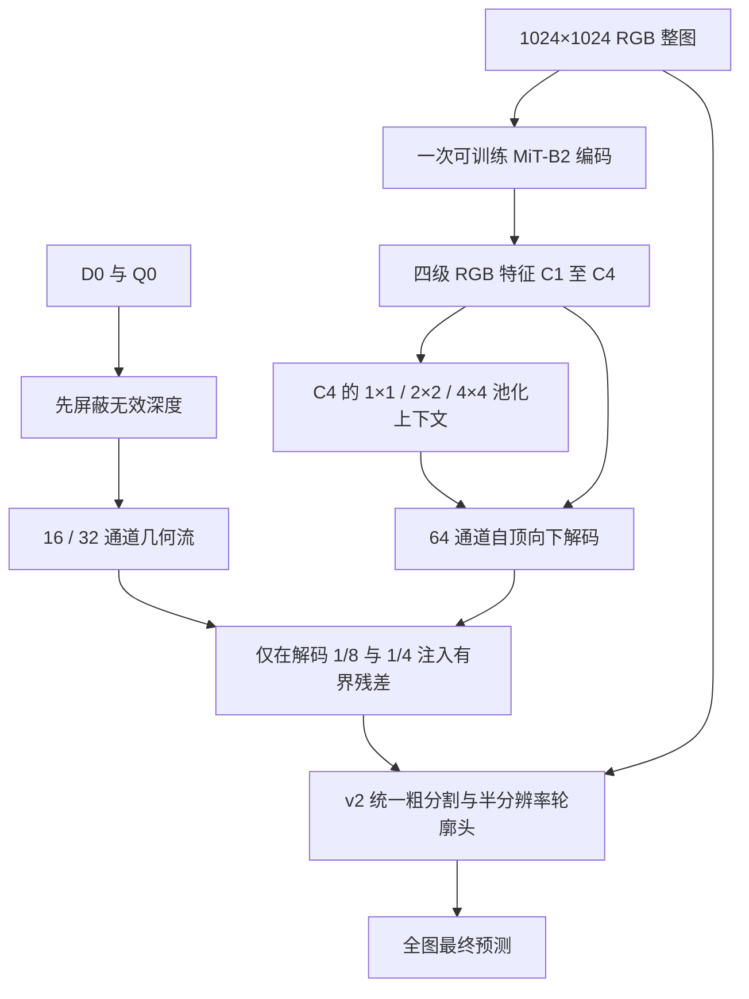

# RPGV v5：整图语义、后期几何补充与统一轮廓

截至 2026-09-28，v5 已实现并完成 Docker 工程验证，**尚未完成收敛训练，不能宣称精度超过 v2**。本轮由 Astra 决定架构与验收条件，GPT-6 Sol 分别执行实验审计、论文核查、模块实现和测试编写。用户确认 v3 未训练，直接训练的是 v4。

## 1. 先读实验，而不是继续堆几何模块

完整结果、来源及未完成实验状态见 [实验审计](analysis/rpgv_v5_experiment_audit.md) 与 [机器可读结果](analysis/rpgv_v5_experiment_audit.json)。下面仅列决策用的关键结果，单位为百分比。

| 运行 | 最佳 Val IoU | Test IoU | 对设计的意义 |
| --- | ---: | ---: | --- |
| v1 原始 stage3 | 76.8698 | 77.1716 | 旧三阶段基线 |
| v1 stage3 重启 | 77.3610 | 77.7362 | 训练路径会影响比较 |
| v2 RGB stage1 | 75.1428 | — | 强 RGB 路径值得保留 |
| v2 三阶段 Full | 78.4041 | 78.5600 | 已完成的主要参照 |
| v2 去 RGR | 78.3314 | — | 最终差仅 −0.0728 pp；单种子，不能作显著性结论 |
| v2 joint_fixed | 78.4425 | — | 最佳 64k，已见验证到 74k；并非完成 100k |
| v4 | 74.4435 | 72.7716 | 40k 已完成，旧设计文档的“未训练”已过时 |

v2 去 RGR 后，阶段二几何 IoU 从 40.1800 降至 21.8563，最终 IoU 却几乎不变。这支持减少“让伪深度独立完成分割”的开销，但不证明深度无效。v4 相比 v2 的差距混合了预算、初始化、目标、上下文与融合位置变化，不能把全部差距归因于早期融合。

两轮快筛必须按实际配置解读：

- 64/256 张 mini-val 的 RGR 短微调相对 Full 分别 +0.2793/−0.5865 pp，排名不稳。
- `progressive_weighted → progressive_contour` 才是轮廓开关，短微调分别 +0.8514/+0.9182 pp，支持优先保留轮廓作为待确认假设。
- `progressive_contour → Full` 前向相同，只增加区域与最终边界损失；Full 略低 0.0888/0.0527 pp，不能把这称为轮廓收益。因此 v5 将结构损失单独消融，而不继续增加其权重。
- 两轮实际只微调 1000/1500 iter，使用 512 crop、batch 8×累积 2；与旧说明中的默认 3000 iter 不同。它们复用了 Full 权重，不能替代从头训练的论文消融。

已有测试集结果仅作历史审计。v5 的新设计选择、超参数和消融筛选使用验证集；不反复查看测试集选方案。

## 2. 架构决策



**RGB 是主路径。** MiT-B2 使用 ImageNet 初始化，所有参数联合训练。几何不改写 encoder 的中间特征，不冻结 RGB，也不加载一个已受联合训练影响的 RGB anchor。`extract_feat` 对相同 RGB、任意深度始终输出相同特征（eval 模式）。

**从现有 C4 获取场景信息。** 1 m 转换保留 1024 m 地面覆盖，1024 整图已经包含场景；不再单独编码 512 thumbnail。C4 池化至 1/2/4 网格，投影至 64 通道并恢复空间尺寸，再自顶向下融合 C3、C2、C1。相比 v2 四级一次等权相加，深层语义先进入中尺度再传到细节层。这是标准多尺度解码思想的项目适配，不把它包装成全新注意力机制。

**几何只补充解码。** 输入为 `[D0×Q0, Q0]`；先屏蔽再做空间卷积，避免 Q0=0 位置的任意深度污染邻居。几何流只有 1/4 的 16 通道和 1/8 的 32 通道。每层融合为：

```text
r = RGB_projection(F)
delta = tanh(Conv1x1(concat(r, G, r*G)))
alpha = 0.5 * sigmoid(a), 初值 0.1
F_next = F + alpha * pooled(Q0) * delta
```

最后投影无后置归一化、非零初始化，首次最终分割梯度即可进入几何路径。每次注入的幅度不超过 0.5×Q0；这不是对最终 logit 的界，也不保证最终精度不下降。Q0 仅表示离线质量，不声称它能预测语义收益。Q0 全零或输入仅三个通道时，depth 模式精确退回**同一权重**的 RGB 路径；该路径不同于独立训练的 RGB 基线。

**保留统一轮廓。** v2 的 coarse + entropy-band bounded SDF correction 保持不变，预测在输入 1/2 分辨率修正。`contour_truncation=5` 对应 5×2×1 m=10 m，与旧版 10×2×0.5 m 相同。损失仍包含 CPU EDT，未声称彻底消除 CPU 开销。

默认损失是 final BCE+Dice + 0.3 coarse + 0.05 region + 0.1 final-boundary + 0.1 SDF。后四项是起始设置，不是已证明的最优权重。删除 RGR、DFGV/Haar 验证、学习可靠度头、独立几何分割头、几何等变/保持任务和双次 RGB 编码。暂不加全局拓扑损失、最大连通块后处理、大模型教师或新的全局几何 attention。

## 3. 与论文的关系及创新边界

Sol 用 Exa 在 4 个方向请求了 91 条检索结果，并核对了 6 篇核心来源；91 不是去重全文阅读数。详见 [论文研究](analysis/rpgv_v5_literature.md)。

- [DFormerv2，CVPR 2025](https://openaccess.thecvf.com/content/CVPR2025/html/Yin_DFormerv2_Geometry_Self-Attention_for_RGBD_Semantic_Segmentation_CVPR_2025_paper.html)支持几何关系可服务最终分割的方向；其真实 RGB-D 假设和预训练不能直接转移到本项目的单目伪深度，本版没有声称复现它。
- [GeomPrompt，2026](https://arxiv.org/abs/2604.11585)启发任务驱动的几何补充和有界修正；本版在解码特征上做两级残差，并未实现该论文的输入 prompt。
- [UPerNet，ECCV 2018](https://arxiv.org/abs/1807.10221)是多尺度场景解析的标准参照；这里以轻量加法路径复用全图 C4，不下载新的预训练主干。
- [遥感边界损失](https://arxiv.org/abs/1905.07852)与 [Boundary and Relation Distillation](https://arxiv.org/abs/2401.13174)提示应检验最终轮廓，而不只看辅助头。默认仍用项目已实现的轮廓监督；蒸馏只有在同 1 m 协议确认教师足够强后才值得增加。

拟检验的贡献是“派生伪几何在完整场景语义主路径之外，以受限后期残差提供可测的最终增益”。各单独算子不是新发明，组合也尚无 WWTP 精度证据；若纯 RGB 容量对照同样有效，应将方法定位为高效分割改进，而不是夸大几何创新。

## 4. 新数据训练与计量

| 项目 | v5 默认 |
| --- | --- |
| 数据根目录 | `wwtp_semantic_dataset_1m`；专用覆盖变量 `WWTP_V5_DATA_ROOT` |
| 文件匹配 | train/val/test = 2435/304/305，RGB/GT/NPZ stems 一致 |
| 输入 | 1024 整图、1 m/px；不放大到 2048、不默认切 512 crop |
| 增强 | RGB 光度 + 同步五通道翻转，10% 额外分支 dropout |
| 正负比例 | 原始样本比例，保留 400 张训练负图；不默认前景过采样 |
| batch / 累积 | 2 / 4，有效 batch 8 |
| 优化 | AMP AdamW；新模块 6e-4，RGB backbone 6e-5 |
| 预算 | 20,000 micro-iterations = 5,000 optimizer updates = 40,000 image exposures，约 16.43 遍训练集 |
| 学习率 | 前 1000 micro-iterations warmup，再 poly；关闭默认早停 |
| 验证 / 选择 | 每 1000 micro-iterations，全 304 张 val，选 Foreground IoU 最佳 |
| 推理 | whole，一次前向覆盖 1024 全图 |
| 物理指标 | `pixel_size_m=1.0`，BF 容差 1.5px=1.5m，小区域阈值 64px=64m² |

旧流程每张 2048 场景采用 1024 crop、768 stride 时需 3×3=9 个窗口，另有 thumbnail 编码；新 whole 推理只需一次。9 倍窗口数差异不是端到端 9 倍加速承诺，数据下采样也会损失细节。旧训练早已使用 1024 crop，所以不能声称训练像素开销天然降低 4 倍。

BF 的原物理容差是 3×0.5=1.5 m。换为 1.5 个新像素保留这一距离定义，但标签栅格变化仍使新旧 BF 不能直接等同；米制 HD 与拓扑阈值必须同步修改。预处理通过 v5 独立配置避免继承 Docker Compose 设置的旧数据根目录。

调整 batch 时要同步累积数、总 micro-iterations、scheduler 和验证间隔以维持更新数与样本暴露量。仅改 batch 会改变实验预算。此首轮预算是筛选起点，不能预先保证充分收敛；若末段 val 仍持续改善，在对照各组上统一延长。

## 5. 工程验证和成本

Docker 镜像：`wwtp-mmseg:1.2.2-cu121`，GPU：NVIDIA L4 23,034 MiB，PyTorch 2.1.2。`tools/test_rpgv_v5.py` 覆盖独立配置、梯度、严格权重恢复、RGB 特征不变性、全/局部无效深度隔离、纯 RGB 容量对照、ignore/全背景和奇数尺寸预测。

真实新数据固定 batch 上，AMP forward + loss（含 EDT）+ backward + AdamW 共 6 步，丢弃前两步计时：

| 模型 | batch | 参数 | 每步秒 | 图/秒 | 峰值 allocated MiB |
| --- | ---: | ---: | ---: | ---: | ---: |
| v2 的 1m 对照模型 | 1 | 26,004,091 | 0.450 | 2.225 | 10619 |
| v4 原配置模型 | 1 | 24,722,666 | 0.281 | 3.564 | 5756 |
| v5 | 1 | 24,391,164 | 0.271 | 3.688 | 5554 |
| v5 | 2 | 24,391,164 | 0.495 | 4.041 | 10752 |
| v5 | 4 | 24,391,164 | 1.002 | 3.993 | 21147 |

计时短、使用随机初始化和重复固定样本，不包含 dataloader I/O、梯度累积和完整验证；不能据此宣布正式训练时间。v4 与 v5 的小差异可能受测量噪声影响。batch=4 的 reserved 达 22034 MiB，且没有吞吐优势，因此选 batch=2。原始记录为 `docs/analysis/rpgv_v5_profile_*.json`；`tools/profile_rpgv_v5.py` 可复跑。无完整 v5 精度结果。

## 6. 最低成本的证伪顺序与验收

所有正式组都在 1 m 数据、相同 ImageNet 初始化来源、相同有效 batch 与更新数下训练，不从 Full checkpoint 微调作为正式消融：

1. 先跑 `no_geometry.py` 与 `rpgv_v5.py`（seed 42），确认额外几何的最终增量。
2. 若有收益，再跑 `rgb_capacity_control.py`。它使用相同额外流与 dropout，但输入为 RGB 灰度和常数门控，完全不读取 D0/Q0。其 Q0=0 不触发回退；显式 `_run_rgb_branch` 才关闭附加流。
3. 确认胜出组，再跑 `no_context.py`、`no_contour.py`、`no_structure_losses.py`。轮廓关闭仍保留 SDF 辅助监督；结构损失组对应旧 Full 与 progressive_contour 的区别。
4. `controls/v2_1m.py`、`controls/v4_1m.py` 提供同数据、同更新预算对照。v2 控制关闭了多余 thumbnail，并采用共同增强；是新协议下的 v2 参照，不是旧配方的逐项复现。v2 特有的辅助目标仍然存在。
5. 仅对候选与关键基线追加 seed 2026/3407，避免一开始把所有变体乘三个种子。

固定 checkpoint 后在完整验证集补充同权重 RGB 回退与确定性空间打乱深度诊断；后者保持 RGB、Q0 不变，只破坏深度配准，属于分布扰动诊断，不能替代独立 RGB 容量对照。报告 IoU、Precision/Recall、BF@1.5m、HD95_m、游离 FP/孔洞和按设施面积分组的召回，按图像配对 bootstrap；不对相关像素作独立重采样。

建议在开跑前锁定实用标准：v5 相对新协议 v2/RGB 最强基线平均 IoU 至少 +0.5 pp，三种子方向一致，配对区间和 BF/HD95 不显示明显退化；同时报告墙钟与显存。+0.5 pp 是决策阈值，不是性能预测。若几何收益消失，交付 RGB-only 版本，保留证伪结果。最终配置固定后才评估测试集；沿用既有划分的测试不是新的独立未见数据集。

## 7. 运行入口

```bash
# 默认不覆盖已有训练目录；这里的命令用于正式训练，本次未启动长训练。
docker compose run --rm wwtp bash scripts/train_rpgv_v5.sh

# 可复跑的结构验证和短步性能检查。
docker compose run --rm wwtp python tools/test_rpgv_v5.py -v
docker compose run --rm wwtp python tools/profile_rpgv_v5.py \
  --batch-size 2 --output /tmp/v5_profile.json

# 恢复同一运行；不要直接加载 v1/v2/v4 的完整 checkpoint 到 v5。
docker compose run --rm wwtp python tools/train.py configs/v5/rpgv_v5.py \
  --work-dir work_dirs/rpgv_v5_1m --resume --disable-early-stopping
```

代码入口：[模型](../wwtpseg/models/segmentors/rpgv_net_v5.py)、[模块](../wwtpseg/models/utils/rpgv_v5_modules.py)、[默认配置](../configs/v5/rpgv_v5.py)、[训练脚本](../scripts/train_rpgv_v5.sh)。既有 v1/v2/v3/v4 实现、结果及用户未提交修改均保留；仅模型注册表追加 v5。
